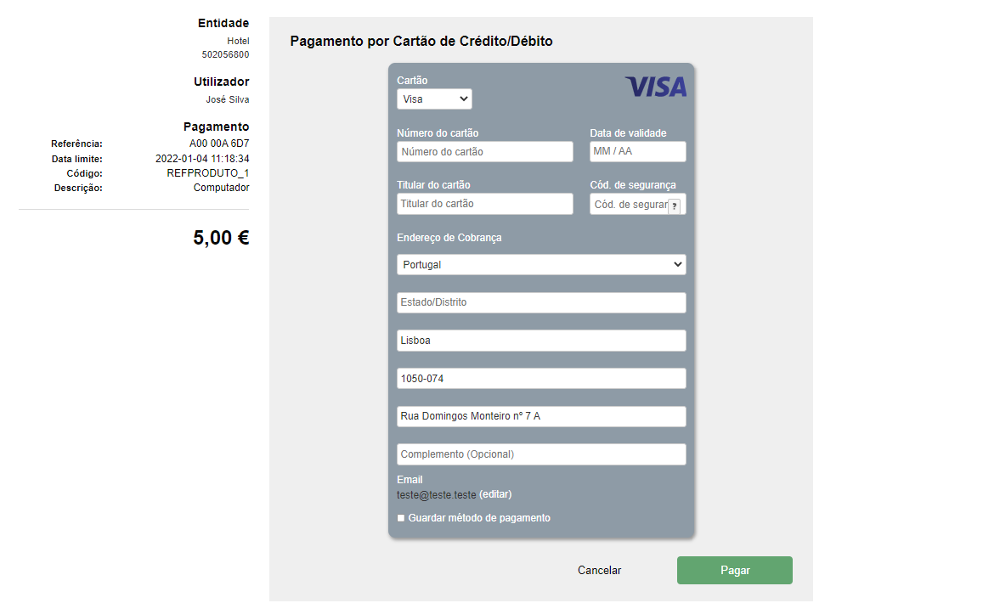

# Tokenização do método de pagamento

A tokenização é o processo que permite armazenar os dados de pagamento confidenciais dos clientes de forma segura por meio da criação de um token.

**Nota:** O aramazenamento do método de pagamento apenas esta disponível para os **pagamentos** com **Cartão de Crédito/Débito e MBWay** e no `layout` **basic** e **default**.

Para criar um token devem ser seguidos os seguintes passos:

1. Obter o UUID do cliente;
2. Compra através de checkout usando o id do cliente registado.

### 1. Obter o UUID do cliente

O primeiro passo é obter o UUID do cliente que pretende registar o seu método de pagamento. Isso pode ser feito através de:

- [Criar cliente](../customers/create.mdx)
- [Consultar cliente](../customers/get.mdx)

### 2. Concluir pagamento através de checkout

Para o método de pagamento ser disponibilizado é necessário concluir um pagamento com sucesso.

> **POST** /checkouts

import ClickShowIframe from "../../../src/utils/ClickShowIframe";

<button className="btn-api btn-api--float-right"
	onClick={() =>
		ClickShowIframe({
			idMenuOption: "checkouts",
			idOption: "checkouts/post/checkouts"
		})
	}
>
	<span>Consultar API &nbsp;&nbsp;&nbsp;{'>'}</span>
</button>

import Tabs from "@theme/Tabs";
import TabItem from "@theme/TabItem";

<Tabs>
<TabItem value="pedido" label="Pedido">

```json
{
	"payment": {
		"amount": 100,
		"recurring": {
			"amountQualifier": "ESTM" // <== Montante váriável
		},
		"customer": {
			"uuid": "e2343605-cf46-43de-b20b-9b7d1c95a9b2" // <== ID do customer registado
		},
		"paymentMethod": {
			"code": "CC",
			"details": {
				"createRegistration": true // <== Indicar que é para criar token
			}
		}
	},
	"page": {
		"language": "PT"
	}
}
```

</TabItem>
<TabItem value="resposta" label="Resposta">

```json
{
	"apiVersion": "1.0",
	"date": "2021-10-20T11:34:48+01:00",
	"success": true,
	"data": {
		"id": "Qldt1DlonfiF4HthdiCfB1DRmgM31LzmVrFjU6jk",
		"createdAt": "2021-10-20 11:34:48",
		"checkoutUrl": "http://paypay.acin.pt/paypaybeta/checkout/v2/form/Qldt1DlonfiF4HthdiCfB1DRmgM31LzmVrFjU6jk",
		"paymentId": "42380",
		"stateDetails": {
			"state": "PaymentReady",
			"timestamp": "2021-10-20T11:34:48+01:00"
		}
	}
}
```

</TabItem>
</Tabs>

### 3. Consultar métodos de pagamento do cliente

Após o pagamento com sucesso o método de pagamento é adicionado aos métodos de pagamento do cliente.

> **GET** ​/customers​/\{uuid}​/paymentMethods

<button className="btn-api btn-api--float-right btn-api--move-top"
	onClick={() =>
		ClickShowIframe({
			idMenuOption: "customer-payment-methods",
			idOption: "customer-payment-methods/get/customers/{uuid}/paymentMethods"
		})
	}
>
	<span>Consultar API &nbsp;&nbsp;&nbsp;{'>'}</span>
</button>

```json
{
	"apiVersion": "1.0",
	"date": "2021-09-24T17:57:42+01:00",
	"success": true,
	"data": [
		{
			"type": "CC",
			"uuid": "90068f83-7623-4de5-91c7-ac447c504ebf",
			"brand": "VISA",
			"last4Digitis": "0809",
			"holder": "Luís Gonçalves",
			"expireMonth": "05",
			"expireYear": "2026"
		},
		{
			"type": "MW",
			"uuid": "45668f83-7623-4de5-91c7-ac447c504ebf",
			"countryCode": "351",
			"last3Digitis": "263"
		}
	]
}
```

# Tokenização com consentimento do cliente

<Tabs>
<TabItem value="pedido" label="Pedido">

```json
{
	"payment": {
		"amount": 500,
		"code": "REFPRODUTO_1",
		"summary": "Computador",
		"customer": {
			"uuid": "e2343605-cf46-43de-b20b-9b7d1c95a9b2" // <== Indicar o uuid do cliente
		},
		"billingAddress": {
			"country": "PT",
			"city": "Lisboa",
			"street1": "Rua Domingos Monteiro nº 7 A",
			"postCode": "1050-074"
		},
		"paymentMethod": {
			"code": "CC",
			"details": {
				"allowRegistration": true // <== Indicar a possibilidade de armazenar o método de pagamento
			}
		}
	},
	"page": {
		"language": "PT",
		"layout": "basic" // <== Indicar o layout que permite armazenar o método de pagamento
	}
}
```

</TabItem>
<TabItem value="resposta" label="Resposta">

```json
{
	"apiVersion": "1.0",
	"date": "2022-01-03T14:16:17+00:00",
	"success": true,
	"data": {
		"id": "pyKP1B9IaK9J47wTSNB4mUnv2h4DJW8HzomddMp1",
		"createdAt": "2022-01-03 14:16:17",
		"checkoutUrl": "https://paypay.pt/paypay/referencia/referencia_c/pay/4d0757e6d4db52fae248e1a2e9f10a1e8cdb0a25/paypay/pyKP1B9IaK9J47wTSNB4mUnv2h4DJW8HzomddMp1",
		"paymentId": "42690",
		"stateDetails": {
			"state": "PaymentReady",
			"timestamp": "2022-01-03T14:16:17+00:00"
		}
	}
}
```

</TabItem>
</Tabs>

Na resposta é devolvido o `id` que identifica o checkout perante a API.
O `checkoutUrl` é o link para aceder a página e realizar o pagamento.
O `paymentId` é o id que identifica o pagamento.

Ao aceder ao `checkoutUrl` é apresentada a seguinte página:


