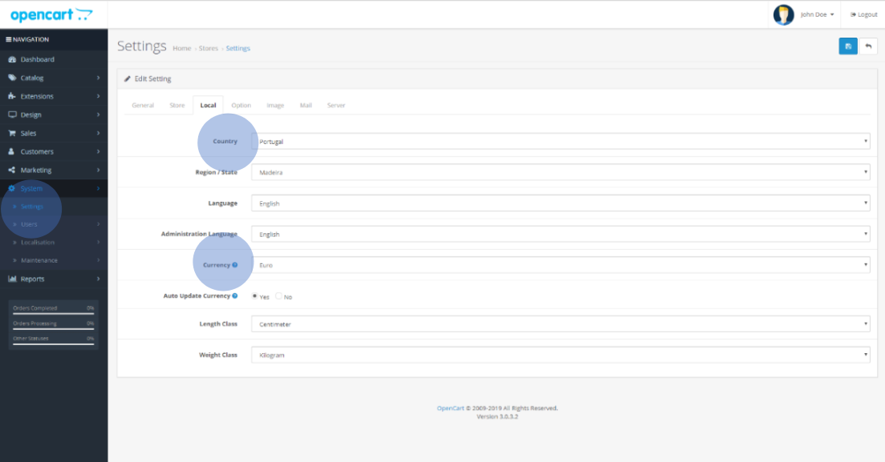

<a href="https://www.opencart.com/index.php?route=marketplace/extension/info&extension_id=27224" target="_blank" className="btn-download">Descarregar</a>

Para executar a integração com a PayPay:
- O comerciante deve estar registado na plataforma PayPay;
- Instalar o OpenCart no seu computador, em www.opencart.com;
- Deve descarregar os ficheiros relativos ao plugin para OpenCart da página https://www.paypay.pt;
- Configurar a informação, com a moeda ‘Euro’ e o país ‘Portugal’ (your-storeurl/admin/index.php) e em Settings > Edit your store > Local;

- Aceder à loja (your-store-url/index.php). Deverá surgir a seguinte prévisualização:

import Link from '@docusaurus/Link';
