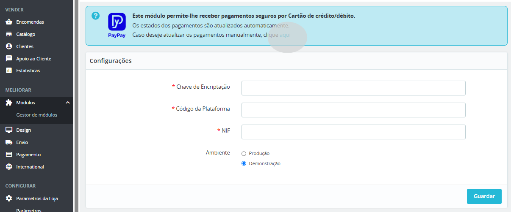

Todos os pagamentos são processados automaticamente. No entanto, caso verifique alguma situação em que o pagamento tenha sido efetuado e o estado da compra não tenha sido atualizado, o administrador poderá fazê-lo manualmente. Para tal, deverá aceder à área de administração da loja PrestaShop, aceder a ‘Módulos’ > ‘Módulos e Serviços’, e clicar na opção ‘Caso deseje atualizar os pagamentos manualmente, clique aqui’.

Após o passo anterior será redirecionado para a área de encomendas do administrador e o estado do pagamento é atualizado automaticamente.

