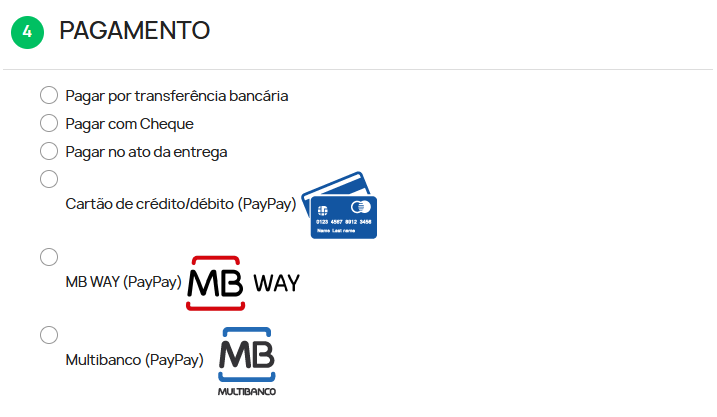
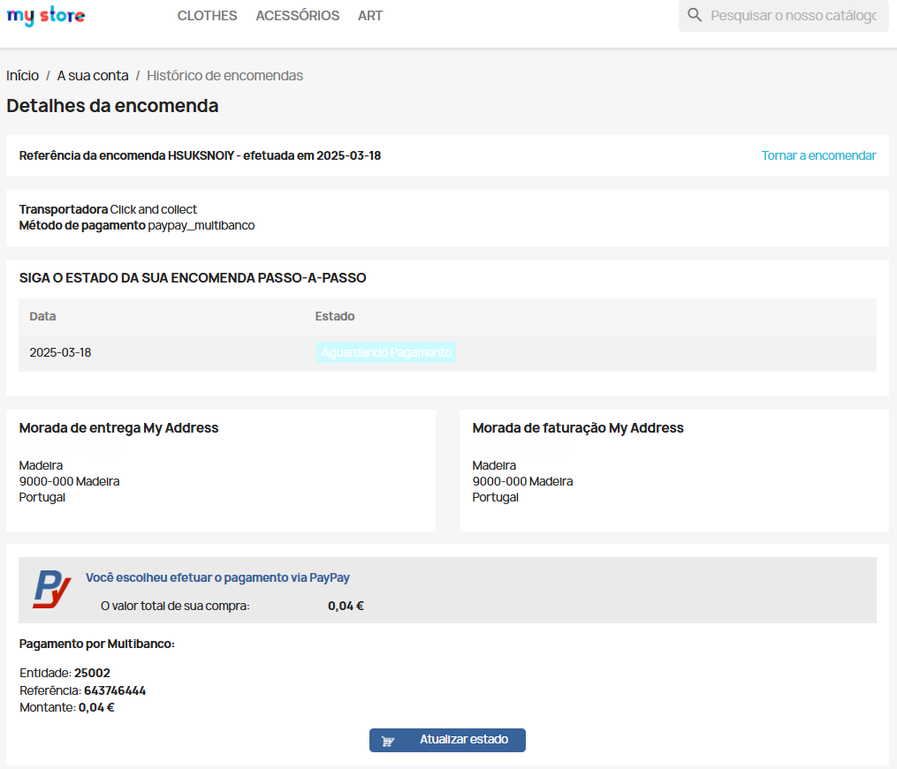
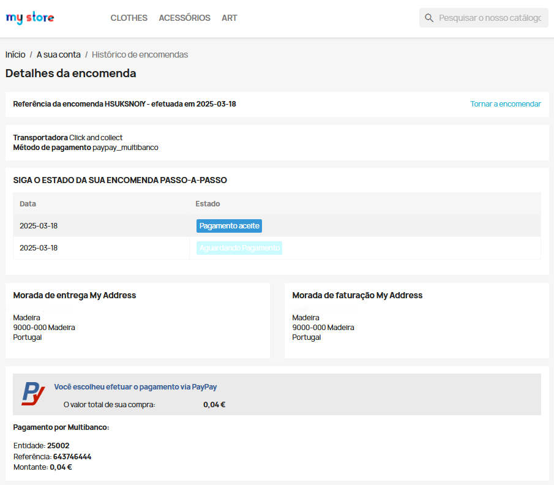
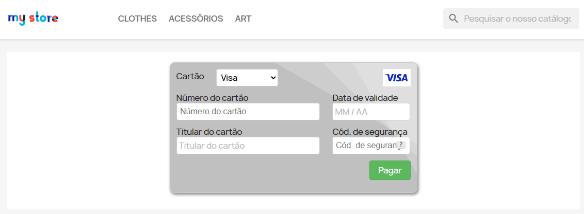
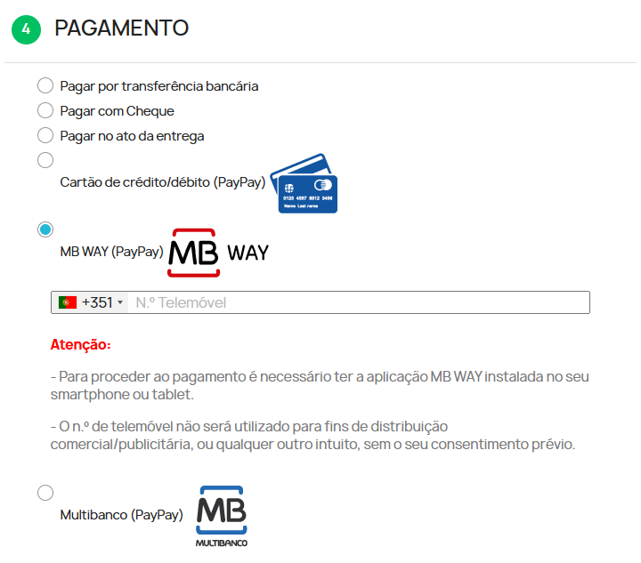
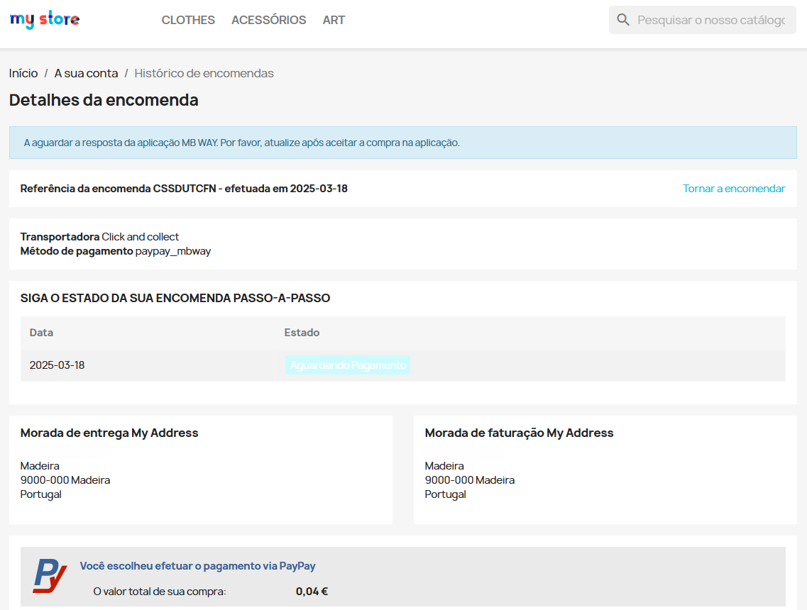
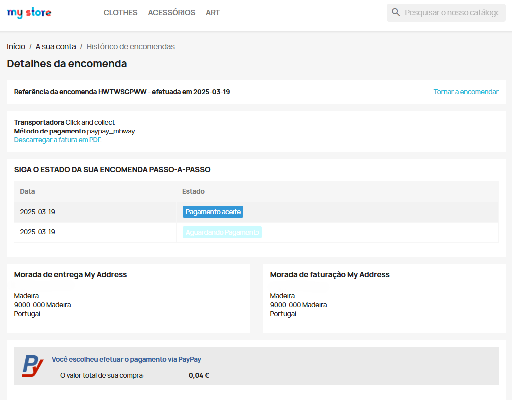

No momento em que o cliente pretende avançar com a compra de umproduto/serviço, deverá selecionar o método de pagamento com a PayPay, como é possível verificar neste exemplo.

Ao selecionar a opção ‘Multibanco’ e encomendar é gerada a referência para pagamento como valor exato da encomenda. Nesta fase o pagamento encontra-se no estado ‘Aguardando pagamento’.

Após efetuar o pagamento numa caixa multibanco ou homebanking, aceda ao histórico de encomendas e confirme o estado da encomenda que deverá estar no estado ‘Pago’.

Caso o cliente tenha selecionado a opção de pagamento por ‘Cartão de Crédito/Débito’, será apresentado a área de pagamento onde deverá inserir os dados do seu Cartão de Crédito e efetuar o pagamento.

Ao concluir o pagamento será apresentado o sucesso da operação e poderá confirmar que o estado da sua encomenda foi devidamente atualizado.

:::info

A sua loja tratará de proceder ao envio, via e-mail, dos dados de pagamento aos seus clientes.

:::

Ao efetuar o pagamento através da opção ‘MB WAY’, introduza o número de telemóvel associado à conta MB WAY..

Após estes passos, será enviado um alerta de pagamento para o número associado. Na aplicação, autorize o pagamento e introduza o PIN MB WAY.

Se o pagamento for realizado com sucesso ao atualizar a página da loja a encomenda é apresentada como paga.

