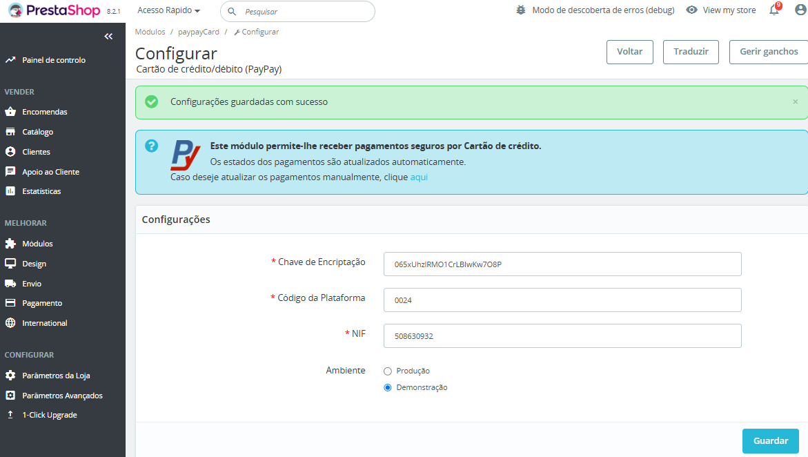

Ao descarregar a pasta zipada, deverá extrair os ficheiros zip. De seguida, realizar os próximos passos para cada módulo que pretenda instalar.

No ambiente de administração/backoffice da sua loja de e-commerce, aceda ao separador ‘Módulos’> ‘Módulos e Serviços’.

Clique na opção ‘Enviar um módulo’.

Será apresentada a seguinte área onde poderá optar por arrastar ou selecionar omódulo a importar. O módulo deverá estar em formato ZIP ou tarball e deverácarregar apenas um de cada vez.

Após o passo anterior o módulo é instalado automaticamente na sua loja. Clique em ‘Configurar’ para iniciar a sua configuração

No formulário deverá introduzir os dados de acesso ao webservice da PayPay. Para obter estes dados, aceda à PayPay em Configurar > Integrações > Plataformas de Integração > Adicionar (Extensão PrestaShop), e no final, selecione a opção ‘Guardar’.

:::info

A sua loja agora está apta para gerar e fornecer os dados de pagamento aos seus clientes, em tempo real, de acordo com o método de pagamento escolhido (Multibanco, Cartão de Crédito/Débito e MB WAY).  
Caso surja alguma dúvida, não hesite em contactar-nos. Estamos disponíveis para ajudá-lo na configuração.

:::
