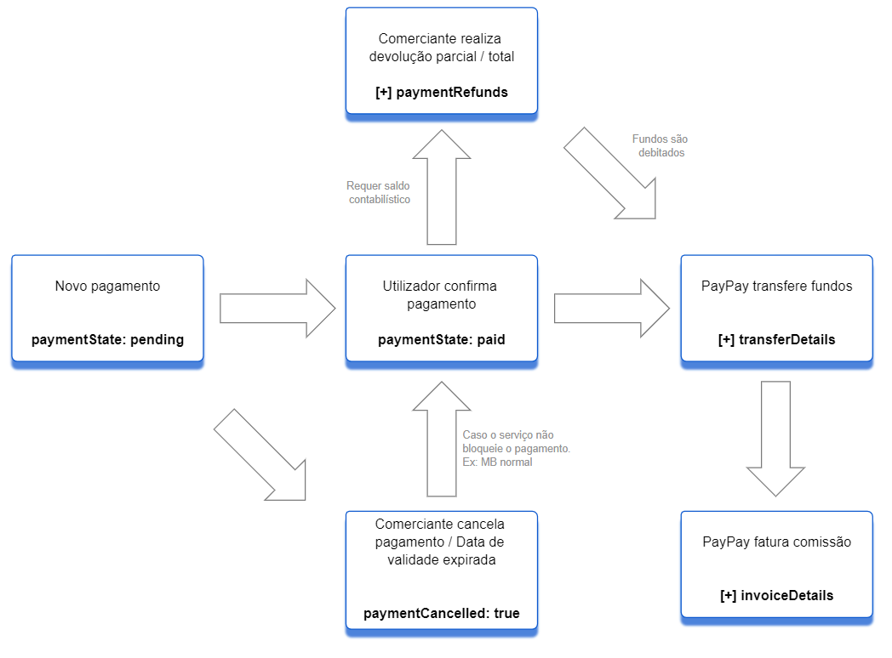

import Translate from '@docusaurus/Translate';

## <Translate id="soap.index.deprecated">A API SOAP está descontinuada, a nova documentação está disponível</Translate> <a href="../docs/guides/intro">aqui</a>.

## <Translate id="soap.index.githubRepo">Repositório GitHub</Translate>
### [GitHub](https://github.com/paypayue/paypay-soap)

## <Translate id="soap.index.requirements">Requisitos</Translate>
* <Translate id="soap.index.requirement1">Para realização de testes utilizar os dados de acesso ao ambiente de testes ou solicitar um novo acesso à nossa equipa de apoio.</Translate>
* <Translate id="soap.index.requirement2">O comerciante deverá estar registado e aprovado na plataforma PayPay;</Translate>
* <Translate id="soap.index.requirement3">Obter dados de acesso da plataforma de integração no backoffice;</Translate>

## <Translate id="soap.index.introduction">Introdução</Translate>

<Translate id="soap.index.intro1">Este guia descreve os requisitos e passos necessários para a integração com a PayPay para os clientes que pretendam ter maior controlo sobre processo de pagamento nas suas aplicações.</Translate>

 
 

<Translate id="soap.index.intro2">São disponibilizados mecanismos para a obtenção de referências de pagamento, pagamento direto do site do comerciante, consulta do estado do pagamento e processamento da confirmação de pagamento.</Translate>

 
 

