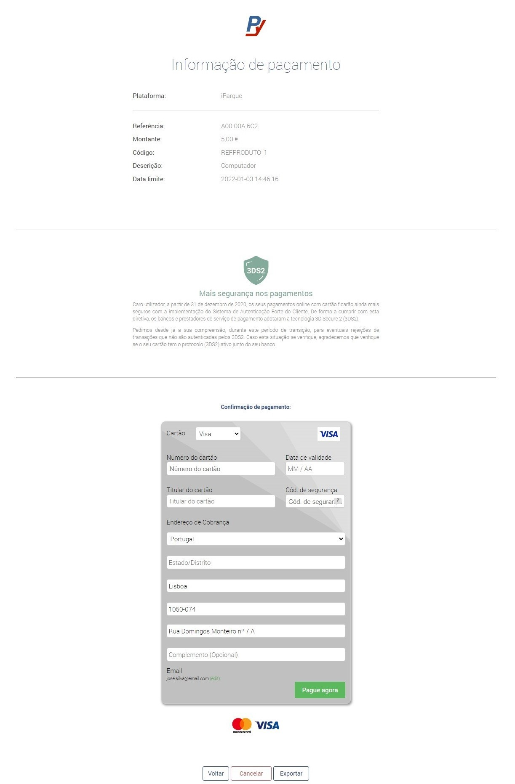

# Checkout Credit/Debit Card

product description, customer details and invoicing address

> **POST** /checkouts

Checkout creation with the following data:

- **Language:** Portuguese
- **Page Layout:** web
- **Amount:** 5€
- **Payment method:** Credit Card (CC)
- **Product code:** REFPRODUCT_1
- **Description of product:** Computer
- **Customer:**
  - **Customer number:** 1,
  - **First name:** Jose,
  - **Last name:** Silva,
  - **Phone number:** 351#961234567,
  - **Email:** jose.silva@email.com
- **Invoicing address:**
  - **Country:** Portugal,
  - **City:** Lisboa,
  - **Address:** Rua Domingos Monteiro nº 7 A,
  - **Postal Code:** 1050-074
- **Redirections:**
  - **After successful payment:** https://www.url-apos-sucesso.dominio
  - **After cancellation of payment:** https://www.url-apos-cancelamento.dominio
  - **Back button:** https://www.url-voltar.dominio

import Tabs from "@theme/Tabs";
import TabItem from "@theme/TabItem";

<Tabs>
<TabItem value="request" label="Request">

```json
{
	"payment": {
		"amount": 500,
		"code": "REFPRODUTO_1",
		"summary": "Computador",
		"customer": {
			"customerId": "1",
			"firstName": "José",
			"lastName": "Silva",
			"phoneNumber": "351#961234567",
			"email": "jose.silva@email.com"
		},
		"billingAddress": {
			"country": "PT",
			"city": "Lisboa",
			"street1": "Rua Domingos Monteiro nº 7 A",
			"postCode": "1050-074"
		},
		"paymentMethod": {
			"code": "CC" // <== Método de pagamento
		}
	},
	"page": {
		"language": "PT",
		"layout": "web"
	},
	"redirects": [
		{
			"type": "success",
			"url": "https://www.url-apos-sucesso.dominio"
		},
		{
			"type": "cancel",
			"url": "https://www.url-apos-cancelamento.dominio"
		},
		{
			"type": "back",
			"url": "https://www.url-voltar.dominio"
		}
	]
}
```

</TabItem>
<TabItem value="response" label="Response">

```json
{
	"apiVersion": "1.0",
	"date": "2022-01-03T14:16:17+00:00",
	"success": true,
	"data": {
		"id": "pyKP1B9IaK9J47wTSNB4mUnv2h4DJW8HzomddMp1",
		"createdAt": "2022-01-03 14:16:17",
		"checkoutUrl": "https://paypay.pt/paypay/referencia/referencia_c/pay/4d0757e6d4db52fae248e1a2e9f10a1e8cdb0a25/paypay/pyKP1B9IaK9J47wTSNB4mUnv2h4DJW8HzomddMp1",
		"paymentId": "42690",
		"stateDetails": {
			"state": "PaymentReady",
			"timestamp": "2022-01-03T14:16:17+00:00"
		}
	}
}
```

</TabItem>
</Tabs>

The response returns the `id` which identifies the checkout to the API.
The `checkoutUrl` is the link to access the page and make the payment.
The `paymentId` is the id that identifies the payment.

Accessing the `checkoutUrl` displays the following page:


