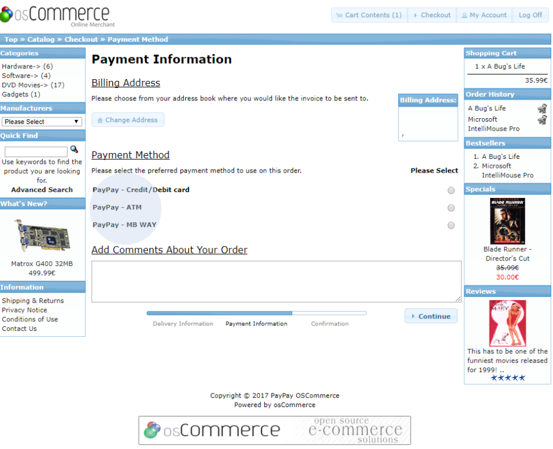
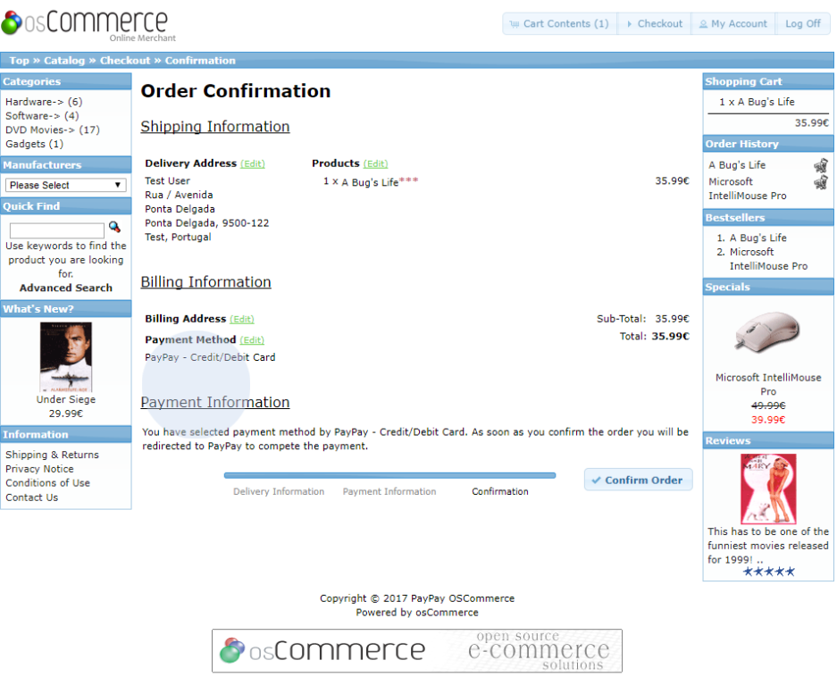
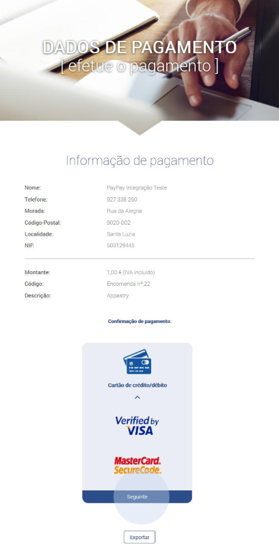
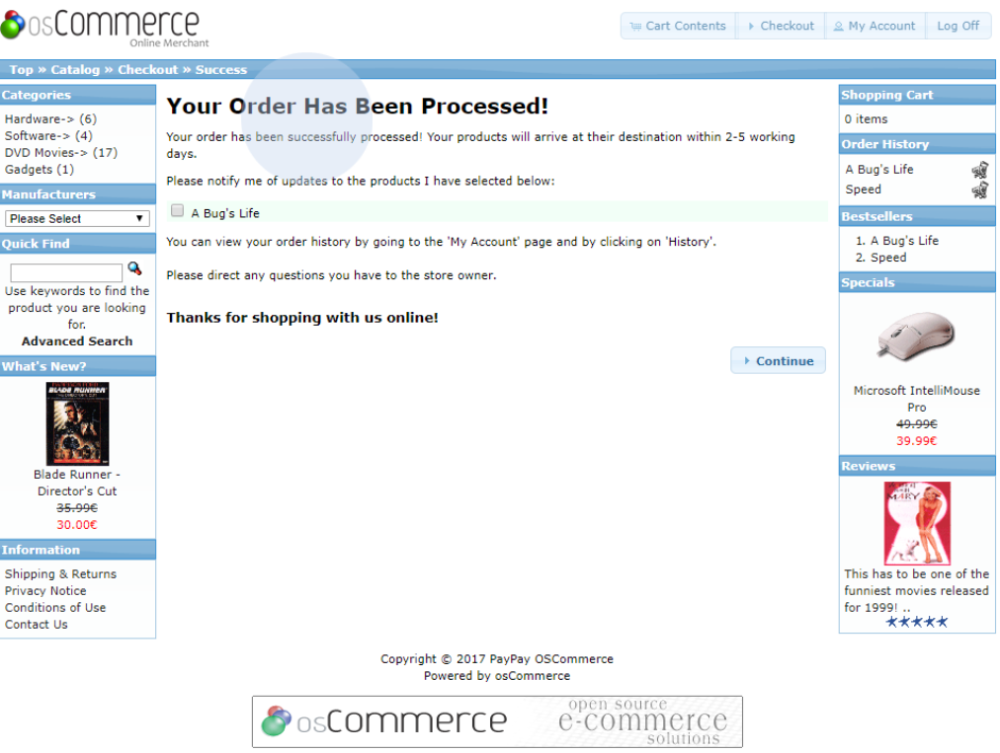
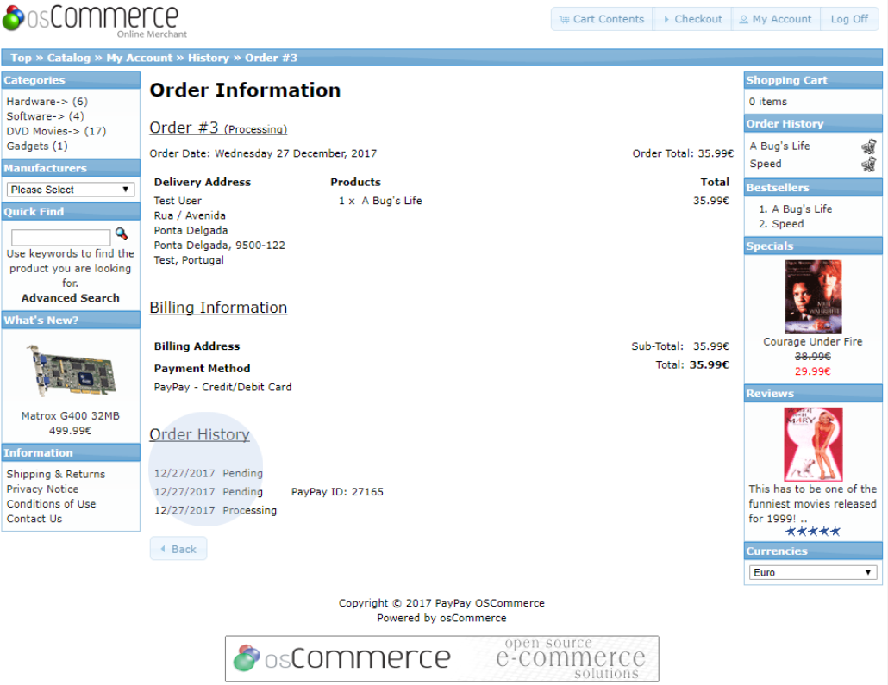

Now, when you log in to your shop, you will be able to see the payment methods when you checkout an order.

In the next step you can check the payment information, where the selected payment method should be displayed.

When the order is confirmed, you will be redirected to the PayPay page where you can complete your payment securely.

:::info

The payment details will also be sent by e-mail to the customer. The configuration for sending e-mails must be correctly set up in the shop.

:::

After payment, the customer will be redirected to the order confirmation page.

In the order list of the customer account, you can check the update of the order status in
detail.

This is the process you should follow to check that the integration is working properly.
