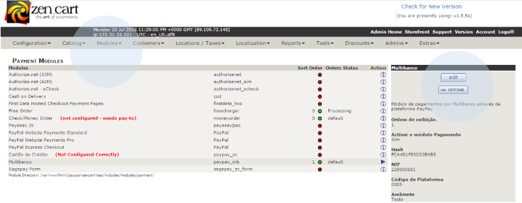

# Manual update of payments

All payments are automatically processed. However, if there is a situation where the payment has been made and the status of the purchase has not been updated in the Zen Cart shop, the administrator can manually update all outstanding payments. To do so, go to ‘Modules’ > ‘Payment Modules’ and click on ‘Edit’ > ‘Update’.



<h2>Aspects to take into account in this integration:</h2>

- You can display the payment details (payment reference or link) in any area (invoice, purchase summary, etc.) by entering the code

```php
<?php
    echo paypay::getPaymentLayout(!empty($zv_orders_id) ? $zv_orders_id : $_GET['order_id']);
?>
```

in the file corresponding to the area in which you want the information to appear (this procedure requires basic knowledge of PHP and HTML). If the order identifier does not appear in any of the variables indicated, you should check which variable should be used.

- To uninstall the plugin, you must run the ‘uninstall.sql’ file (provided with the plugin files) and uninstall the plugin in the administration area.

:::warning

If you run the ‘uninstall.sql’ file, all data relating to payments made from the Paypay plugin will be permanently deleted.

:::
