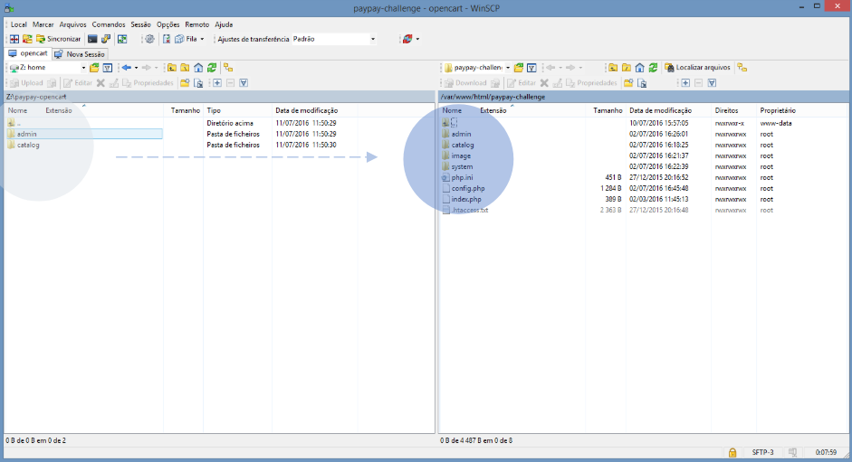
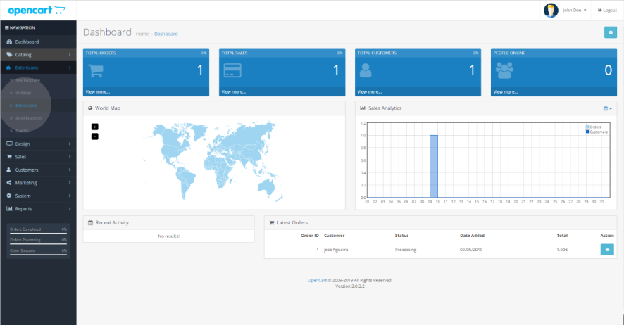
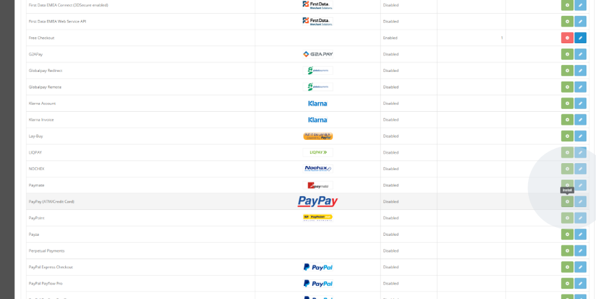
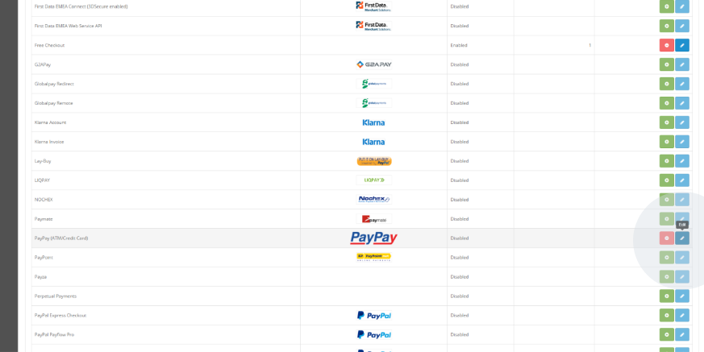
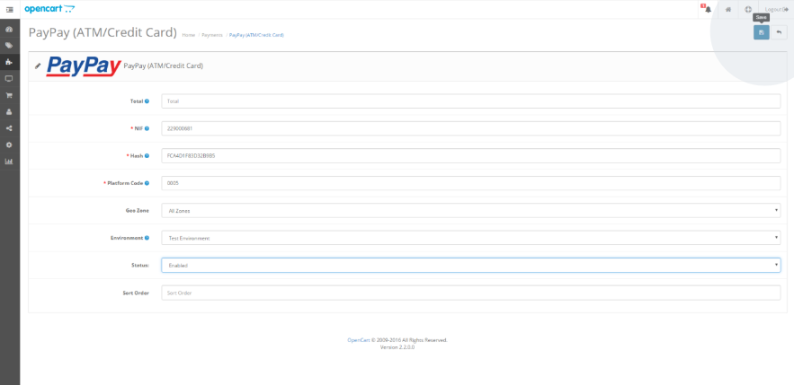

Copy the files downloaded from https://www.paypay.pt into your OpenCart installation folder:

In the administration 'Dashboard' of your e-commerce shop, go to the extensions installation tab in ‘Extensions’ > ‘Extensions’.

Install the extension:

Click on the edit option:

Enter the credentials provided by your PayPay account administrator.
If the credentials are not correct, an error message will appear and it will not be possible to save the settings. Once you have entered the correct details, click on save.

