To verify that the PayPay setup is successful, go to your shop page and add a product/service to the ‘ShoppingCart’ cart. Click on ‘Checkout’ to proceed to payment.

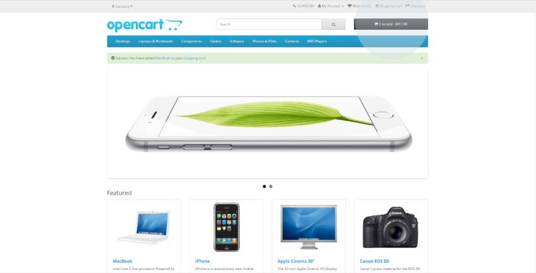

To complete the purchase, during the ‘Checkout’ you will be asked to log in or register. If you already have an account, log in; otherwise, register with an account of your choice.

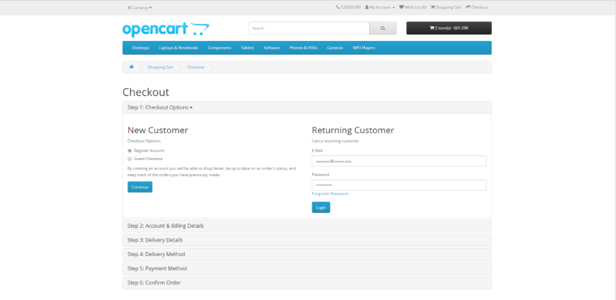

Go to the ‘Checkout’ page. Enter the delivery details and, in the ‘Payment Method’, select the PayPay payment method. Then, click on ‘Continue’

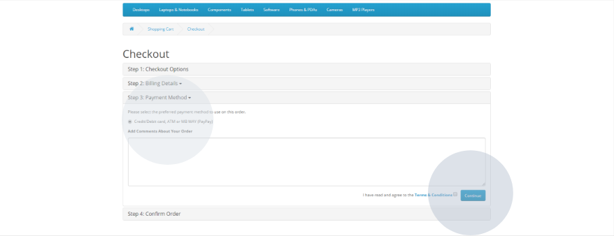

To confirm the order, click on ‘Confirm Order’ nd confirm your order details. You must choose whether you want to pay by credit card (‘Credit Card’), ATM (‘Multibanco’), or ‘MB WAY’. The credit/debit card option is selected by default, just click ‘Confirm Order’.

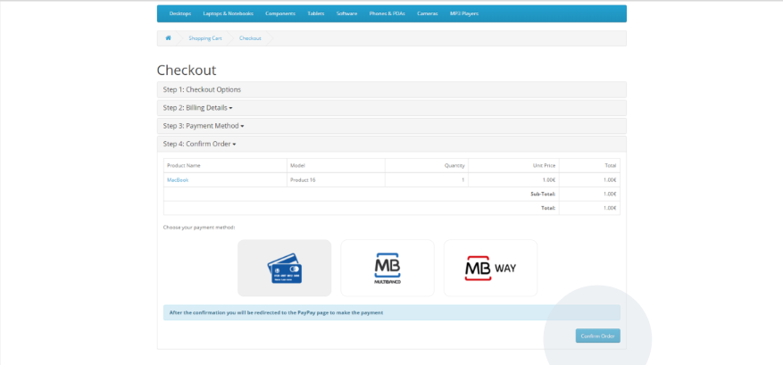

## Credit/debit card
After clicking on the ‘Confirm Order’ button, you will be redirected to the PayPay platform to make the payment. A card like the one shown in the image will appear and you will be asked for your credit/debit card details (card number, expiry date, cardholder name and security code).

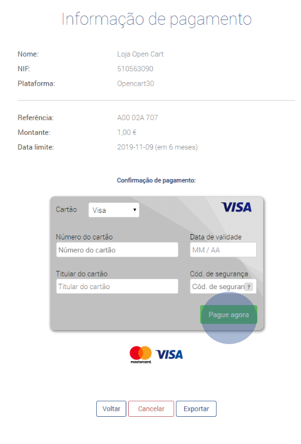

After clicking on the ‘Pay now’ button and if the payment has been successful, the payment information associated with the purchase will appear and you can download the payment receipt and click on the ‘Back’ button to the shopping site.

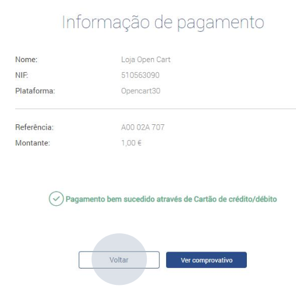

On the shopping site you will see all the information relating to the purchase, the delivery address details, the type of payment and the amount associated with the purchase. In the purchase history table, you can see that the order is already being processed (‘Processing’).

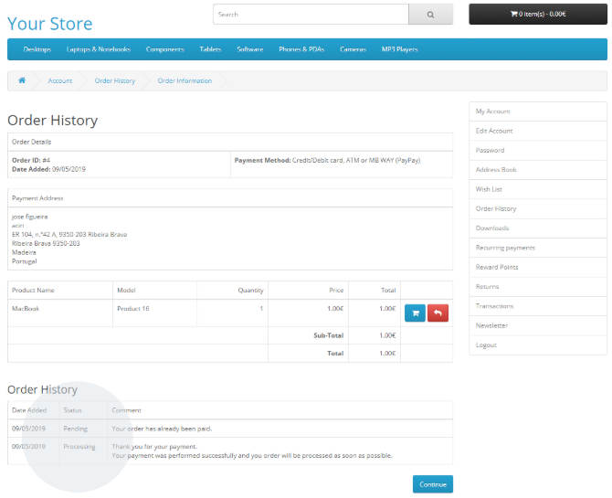

## ATM (Multibanco)
After clicking on the ‘Confirm Order’ button, you will be redirected to the PayPay platform to make the payment. When you select the ATM (‘Multibanco’) payment method, the bank, the reference and the amount will be displayed. You can ‘Export’ the information to proceed with the payment.

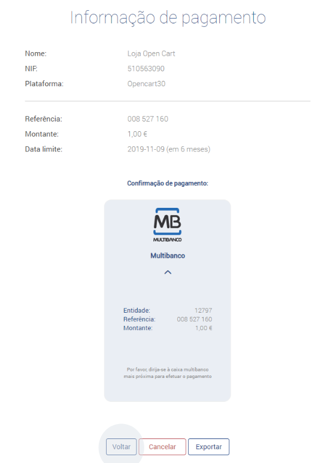

On the shopping site you will see all the information relating to the purchase, the delivery address details, the type of payment and the amount associated with the purchase. In the purchase history table, you can see that the order is already being processed (‘Processing’), until payment is made.

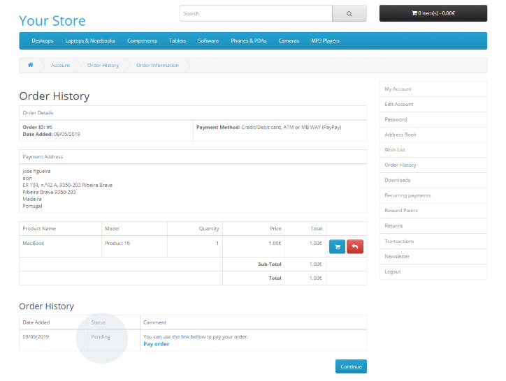

## MB WAY
After clicking on the ‘Confirm Order’ button, you will be redirected to the PayPay platform to make the payment. The ‘Payment Information’ will appear and you will be asked for your mobile phone number. Once you have entered your number, simply click on ‘Next’.

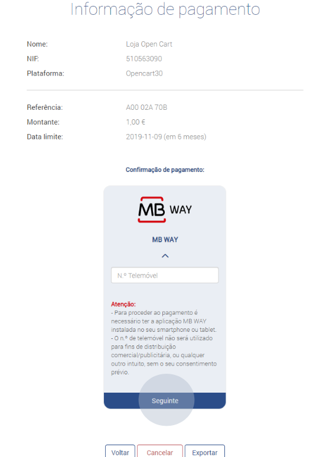

Once the payment has been made and if it has been made correctly, the payment information associated with the purchase will appear and you can download the payment receipt and click on the ‘Back’ button to the shopping site:

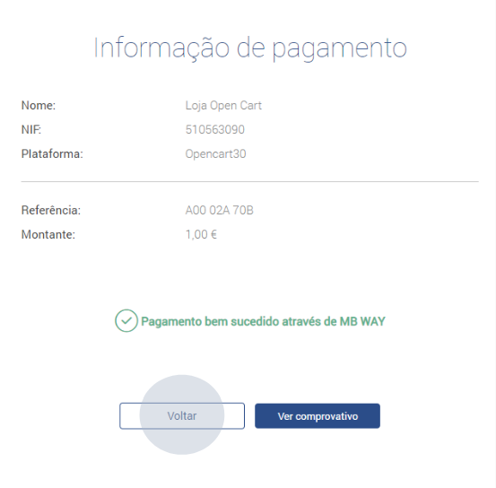

On the shopping site you will see all the information relating to the purchase, the delivery address details, the type of payment and the amount associated with the purchase. In the purchase history table, you can see that the order is already being processed (‘Processing’).

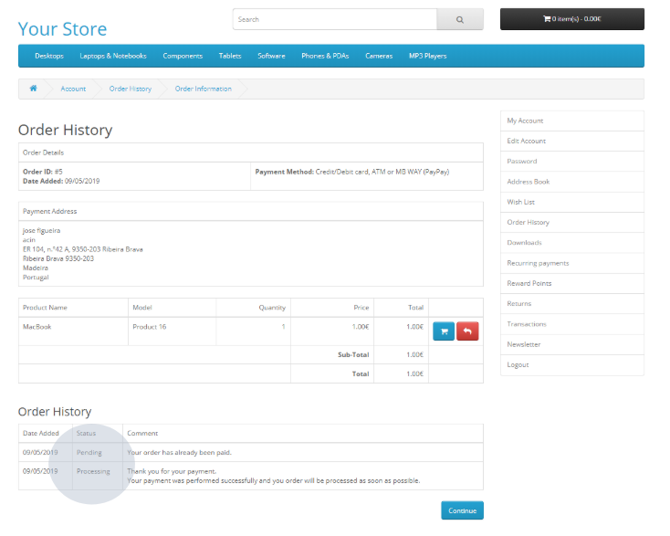
