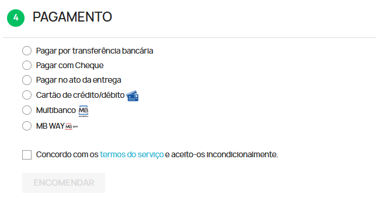
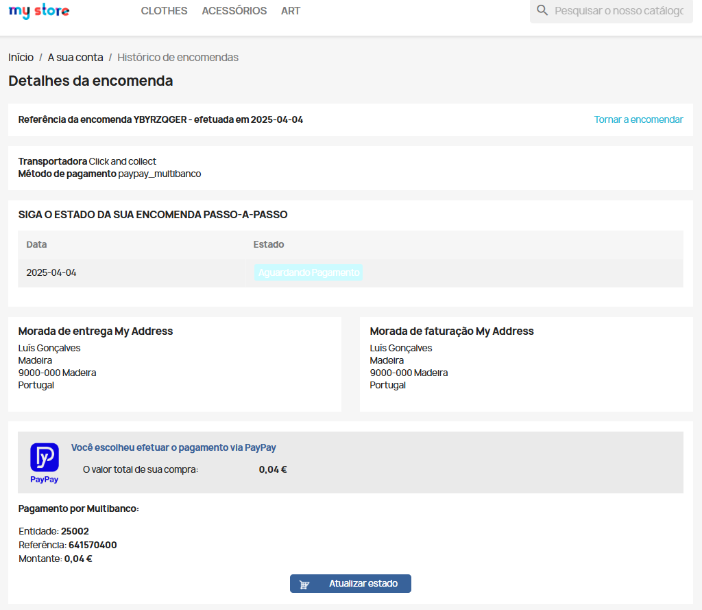
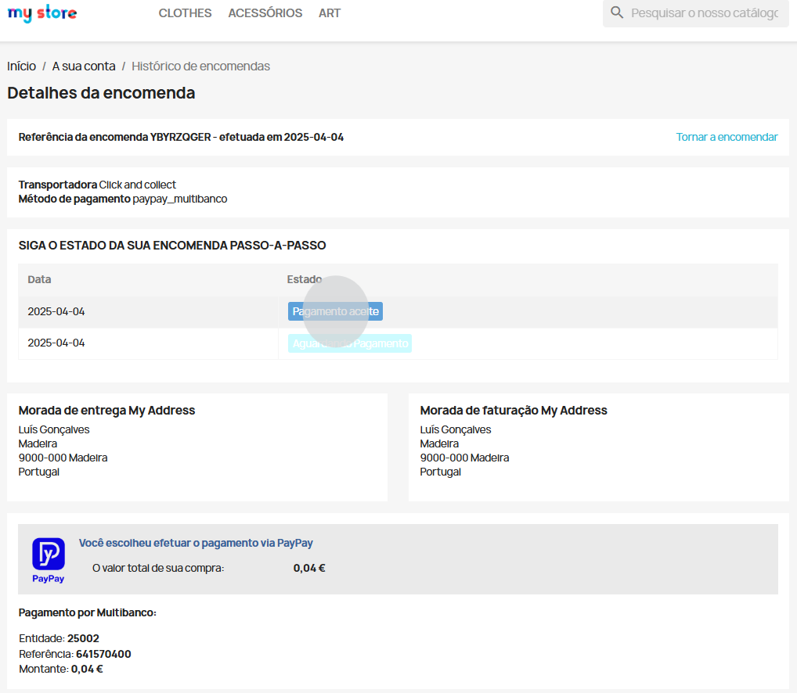
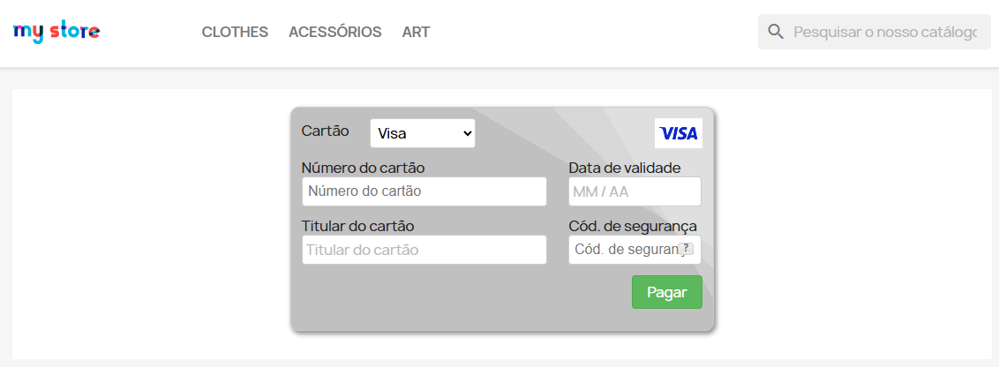
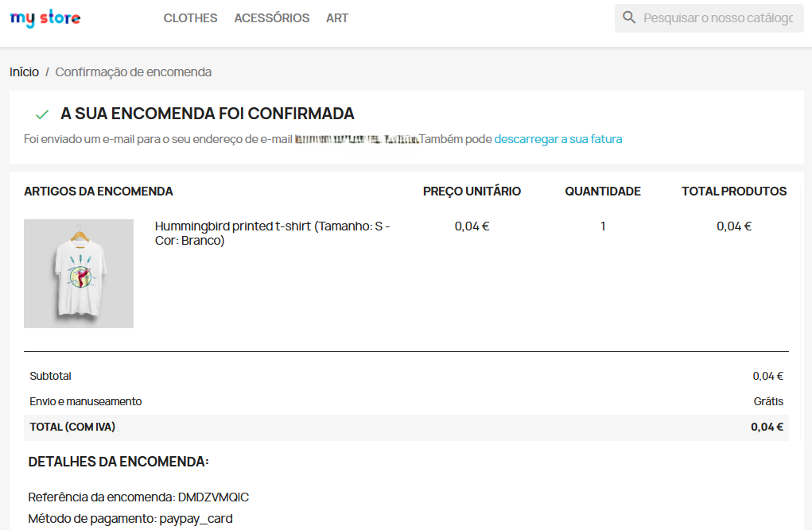
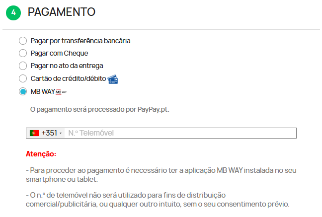
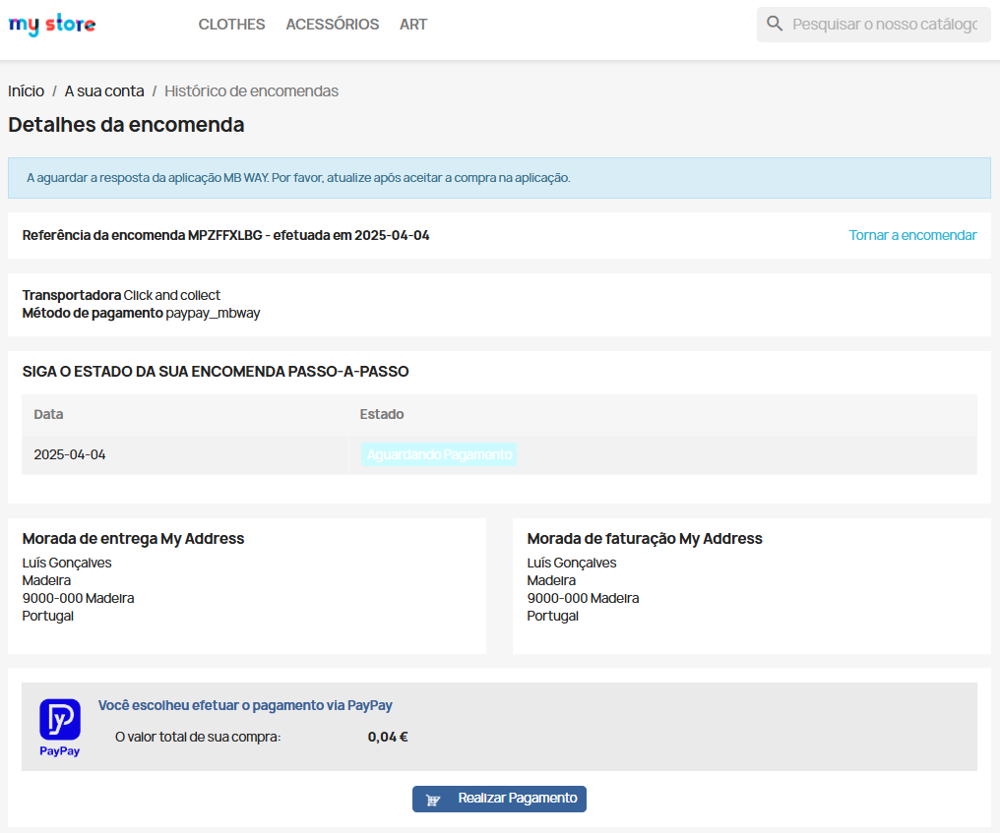
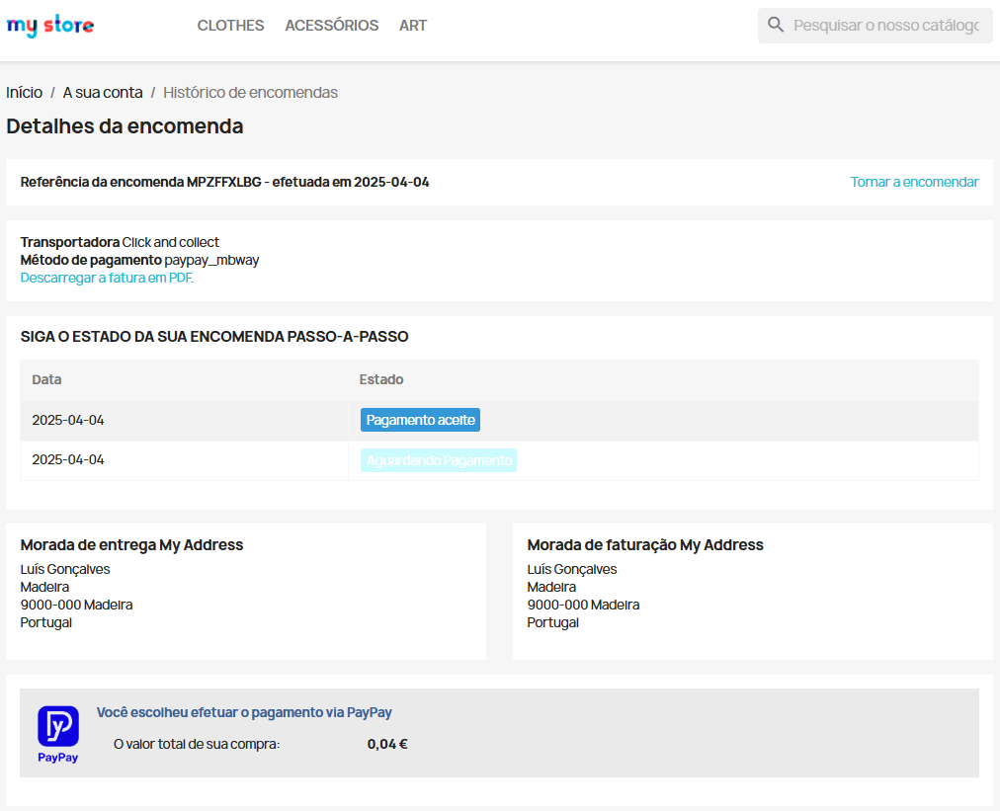

When the customer wants to proceed with the purchase of a product/service, he/she should select the payment method with PayPay, as shown in the following example:

When the ‘Multibanco’ (ATM), option is selected and placing the order, the payment reference is generated with the exact amount of the order. At this stage the payment is in the ‘Waiting for payment’ status.

After making the payment at an ATM (Multibanco) or by homebanking, access the order history and confirm the status of the order, which should be in ‘Paid’ status.

If the customer has selected the ‘Credit/Debit Card’ payment option, the payment area will be displayed where they must enter their Credit Card details and make the payment.

When you complete the payment, the success of the operation will be displayed and you will be able to confirm that the status of your order has been duly updated.

:::info

Your shop will be responsible for sending the payment details to your customers by email.

:::

When paying using the ‘MB WAY’ option, enter the mobile phone number associated with your MB WAY account.

After these steps, a payment alert will be sent to the associated number. In the application, authorise the payment and enter the MB WAY PIN.

If the payment is successful when you refresh the store page the order is displayed as paid.

