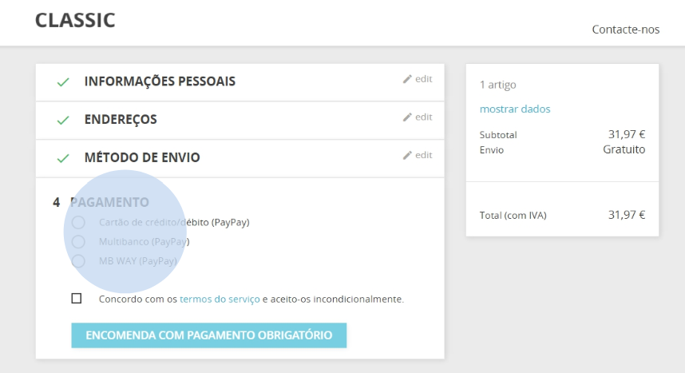
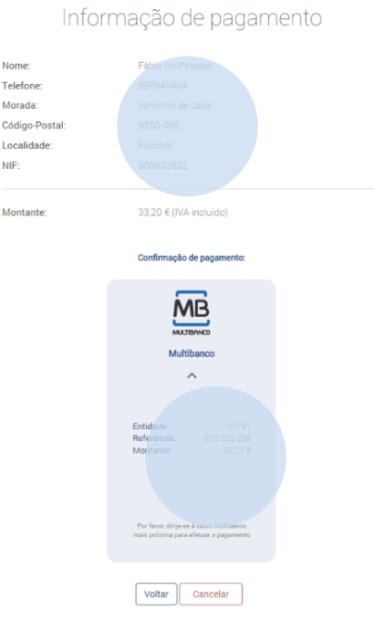
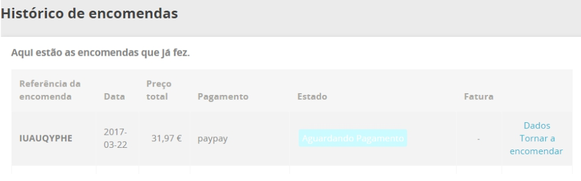
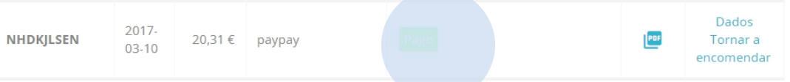
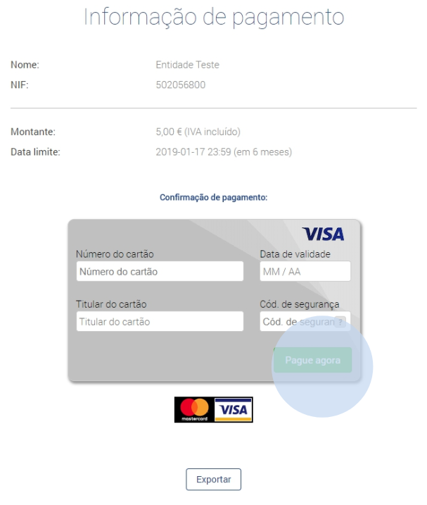
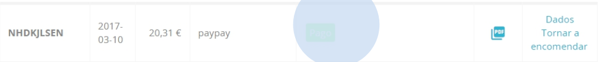
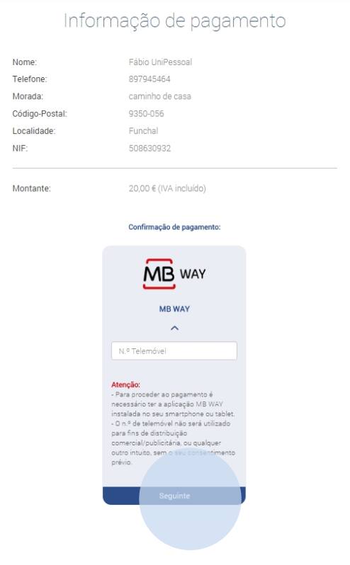
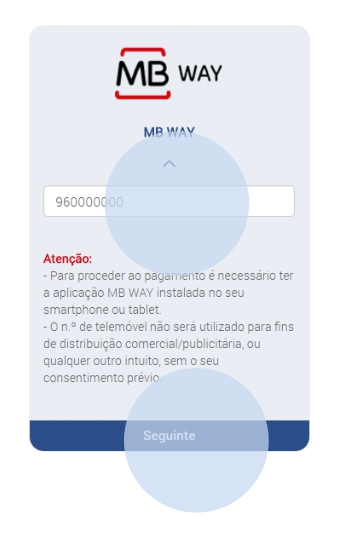
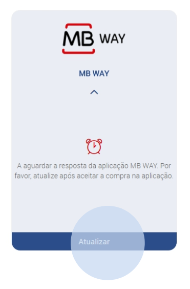
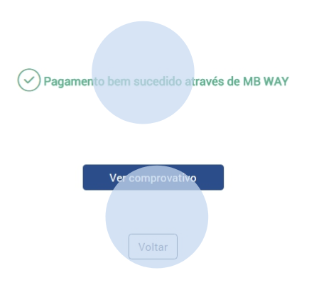

When the customer wants to proceed with the purchase of a product/service, he/she should select the payment method with PayPay, as shown in the following example:

When the ‘Multibanco’ (ATM), option is selected, the payment reference is generated with the exact amount of the order. In this area you can only check the summary of your purchase.

By clicking on ‘Back’ you will be redirected to the order history. At this stage, the payment is in the status ‘Awaiting payment’

After making the payment at an ATM (Multibanco) or by homebanking, access the order history and confirm the status of the order, which should be in ‘Paid’ status. The payment may take up to 12 business hours to be processed.

If the customer has selected the ‘Credit/Debit Card’ payment option, he/she will be redirected to the PayPay payment area. He/she will have to enter his/her credit card details and make the payment.

By accessing the PrestaShop shop it is possible to confirm that the status of the order
has been duly updated.

:::info

Your shop will be responsible for sending the payment details to your customers by email.

:::

When paying using the ‘MB WAY’ option, you will be redirected to the PayPay payment area.

Enter the mobile phone number associated with your MB WAY account.

After these steps, a payment alert will be sent to the associated number. In the application, authorise the payment and enter the MB WAY PIN. Once the payment has been made, click on the ‘Update’ option.

If the payment is successful, you will see the message shown below. By clicking on ‘Back’, you will be redirected to your PrestaShop shop. To obtain the proof of payment, click on the available option.

