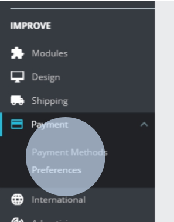
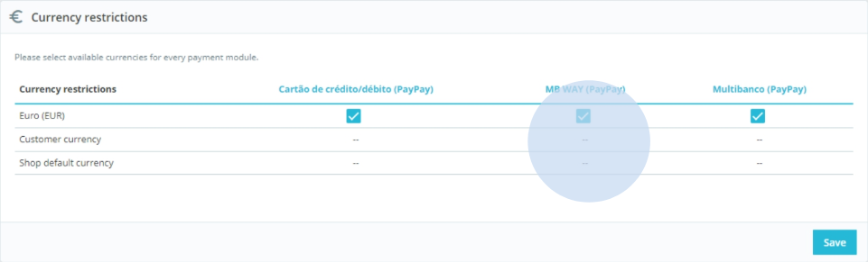
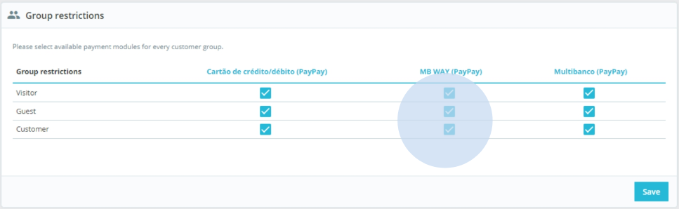
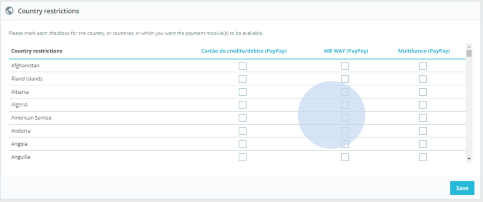
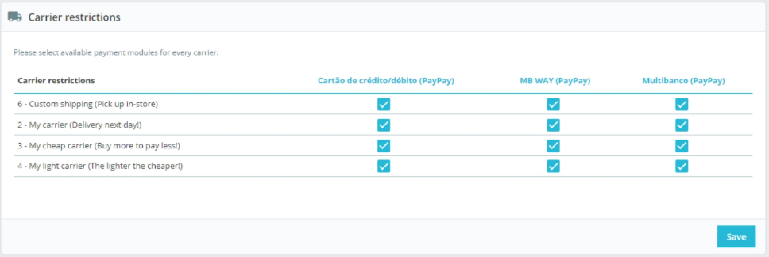

By accessing Prestashop´s payment preferences you can configure the payment methods that will be available to your customers according to currency, country, user profile or carrier.

## Restrictions per currency

Select the available modules according to the applicable currency type:

:::info

PayPay modules only support EUR.

:::

## Restrictions per group

Select the available modules per user group:

## Restrictions per country

Select the countries in which the modules will be available.

## Restrictions per carrier

Select the modules available for each carrier:

