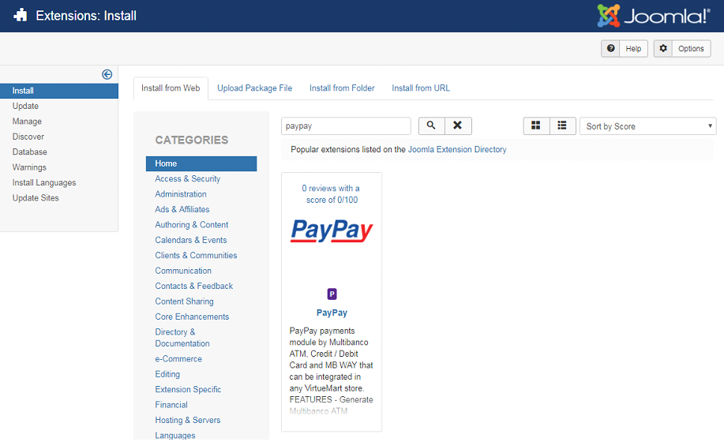
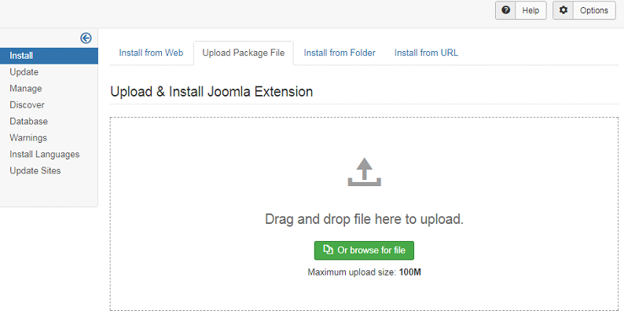
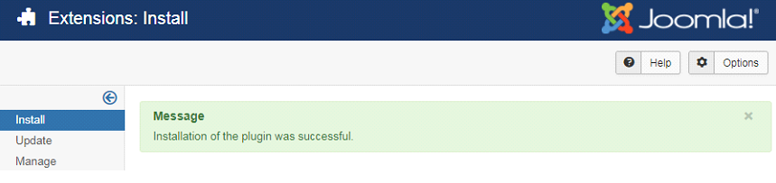

In the administration/backoffice environment of your VirtueMart shop, go to the menu ‘Extensions’> ‘Manage’ and select the ‘Install’ option.

Installation can be done in two ways:  or by uploading a file.

- [Installation from the shop](#installation-from-the-shop)
- [Installation by uploading a file](#installation-by-uploading-a-file)

## Installation from the shop

Select the ‘Install from Web’ option and enter the name of the PayPay platform.

Select the PayPay plugin.

Click on ‘Install’.

Confirm the installation by clicking on ‘Install’.

## Installation by uploading a file

Select the ‘Upload Package File’option,

drag the file to the upload area or select it.

Si la instalación se ejecuta correctamente, se mostrará el mensaje de éxito.

After installation, go to ‘VirtueMart’ > ‘Payment Methods’ to create the payment methods
(ATM -Multibanco-, Credit/Debit Card or MB Way).

Click on ‘New’.

In the ‘Payment Method Information’ área, fill in the form with the details of the payment method you want to add, selecting ‘PayPay’ in the ‘Payment Method’ field. Then click on ‘Save’.

After the previous step, click on the ‘Configuration’ area and enter the PayPay integration
data displayed in the backoffice (integrations). When finished, click on ‘Save’.

:::warning

You must select the same payment method you entered in the previous step

:::

If the data entered is correct, a success message will be displayed.

Otherwise, the following error message will be displayed.

Once the configuration is complete, you will see the payment methods created.

You can use the test environment to test the integration before starting it in the production
environment. To do this, use the following access data:

<table>
    <tr>
        <td>NIF:</td>
        <td>507983807</td>
    </tr>
    <tr>
        <td>Código de Plataforma:</td>
        <td>0037</td>
    </tr>
    <tr>
        <td>Chave de encriptação:</td>
        <td>UCYNgCLV9BwjBI5FIJi7GPNI</td>
    </tr>
</table>

Go to https://paypay.acin.pt/paypaybeta/ and check the status of your payments:

<table>
    <tr>
        <td>Utilizador:</td>
        <td>virtuemart@paypaybeta.pt</td>
    </tr>
    <tr>
        <td>Password:</td>
        <td>yGj2eYVMENk4</td>
    </tr>
</table>
