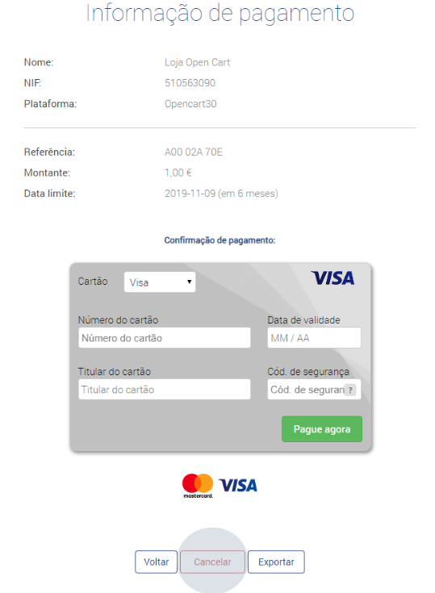
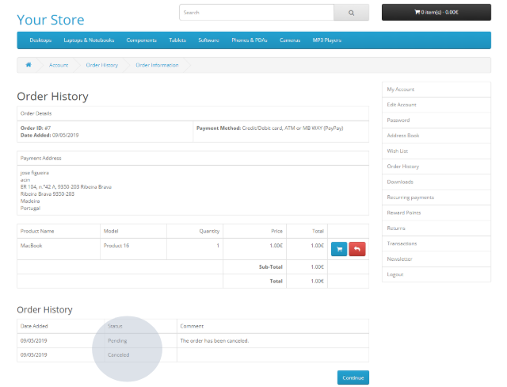
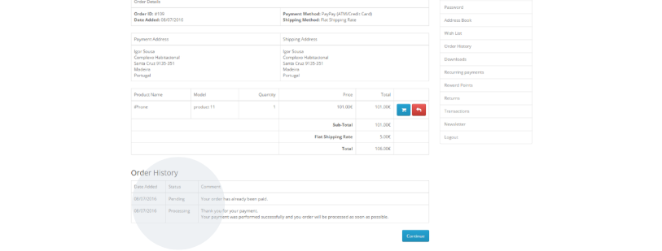
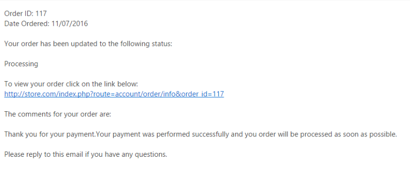

# Cancel the order

You can cancel any type/method of payment. Simply click on ‘Cancel’.

If the payment is canceled, you will see in your purchase history that the payment has been canceled (‘Canceled’).

Your order information will be available in the private area, with the payment reference, entity and amount. The payment details will also be sent by email.
Once payment has been made, the status of the order will be duly updated in the order history.

Example of an email with payment details:

:::info

Now your shop can generate and provide payment data to your customers in real time, according to the chosen payment method: Credit/Debit Card, ATM (Multibanco) or MB WAY  
Payment details will be sent by email to your customers and the PayPay payment identifier can be viewed in the purchase history. Once the payment has been made, you will receive a confirmation email from PayPay.  
If you have any questions, please do not hesitate to contact us.

:::
