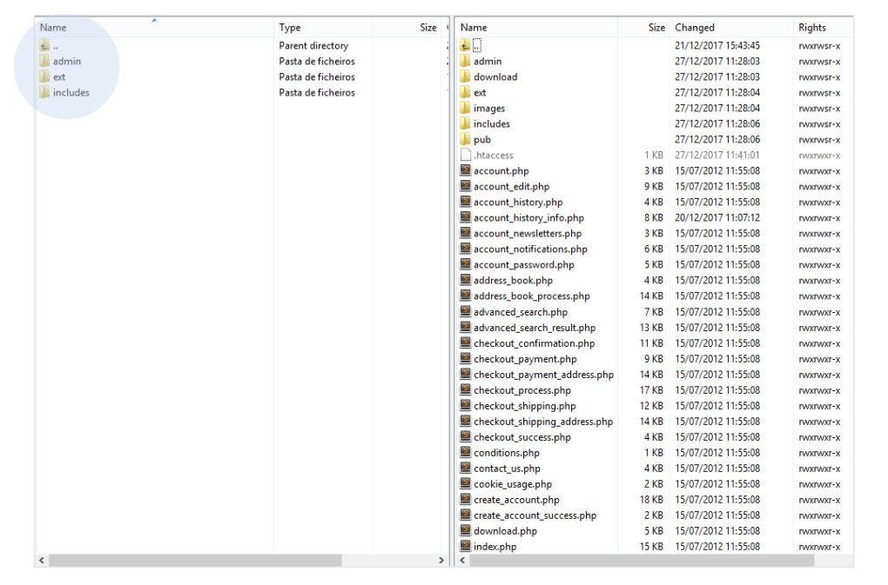
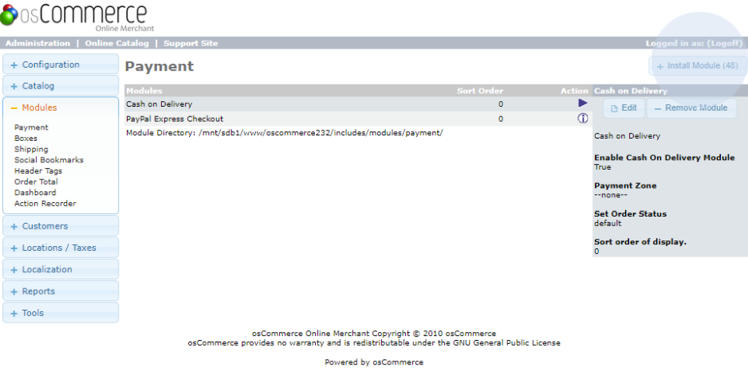
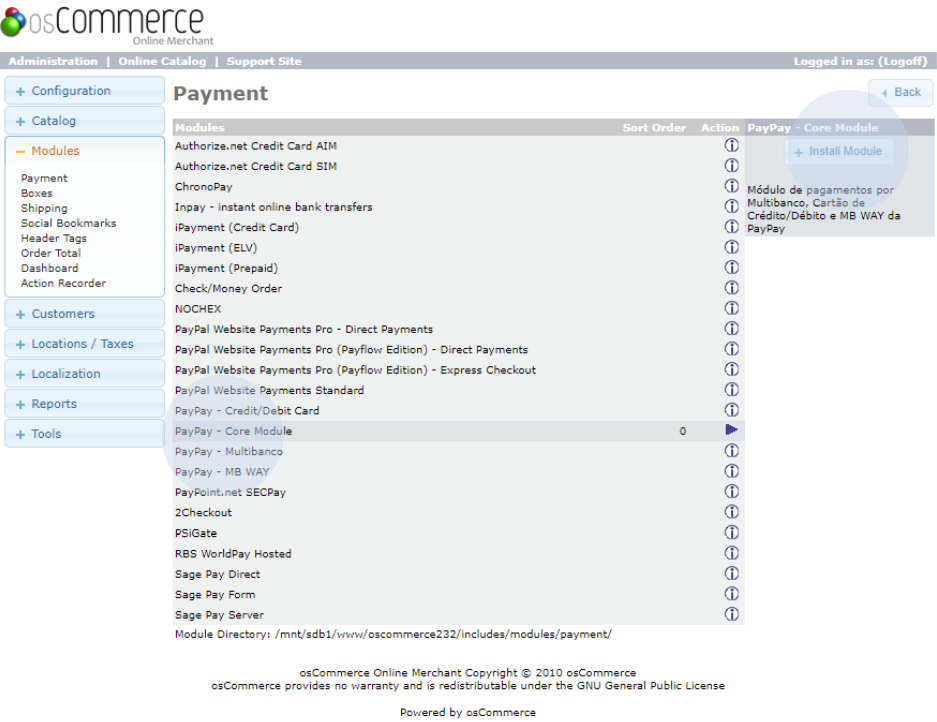
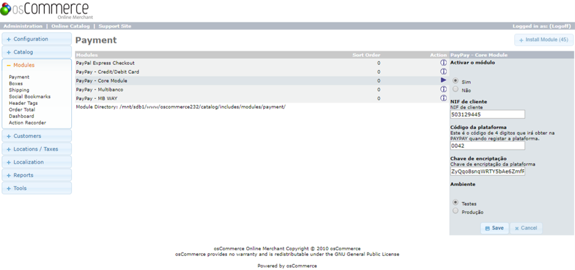
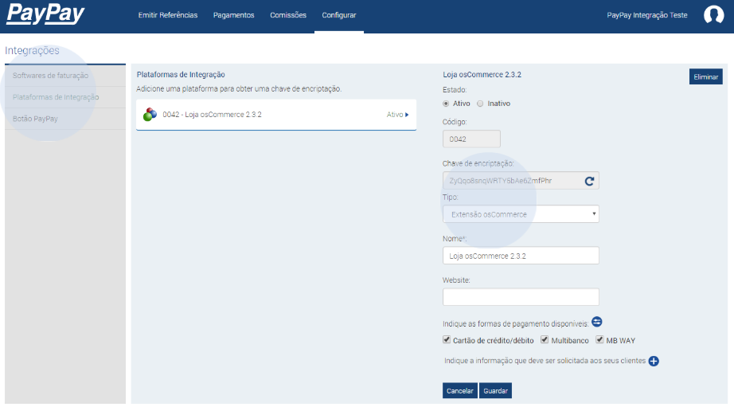
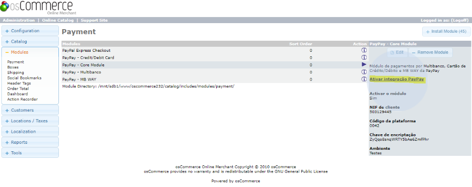

# Installation

Download the osCommerce PayPay module available at https://paypay.pt/paypay/#integracoes. Then, extract the files from the zip and copy the provided files into the ‘catalog’ folder containing the installation files of your osCommerce shop, as shown in the following figure.

Once all files have been successfully copied, go to your administration area in the payment modules menu. Click on ‘Install module’ to see the modules you wish to install, which should include the following PayPay modules:
- PayPay - Core Module (obrigatório);
- PayPay - Credit/DebitCard;
- PayPay - Multibanco;
- PayPay - MB WAY

Select the PayPay - Core module and click on ‘Install module’. This module is mandatory. As
for the others, you can select and install the ones you want to use.

It is recommended to use the test environment before moving to the production environment. If you want, you can enter the following login details:

<table>
    <tr>
        <td>NIF de cliente</td>
        <td>503129445</td>
    </tr>
    <tr>
        <td>Código de Plataforma:</td>
        <td>0042</td>
    </tr>
    <tr>
        <td>Chave de encriptação:</td>
        <td>ZyQqo8snqWRTY5bAe6ZmfPhr</td>
    </tr>
</table>

To obtain the access data for the production environment, you will need to log in to your PayPay customer area.

Once you have completed and saved the data, you will be able to view them, as shown in the following image.

:::warning

You should always click on the link ‘Ativar integração PayPay’ to confirm that the settings are correct and to activate the automatic payment communication between PayPay and your shop.

:::
