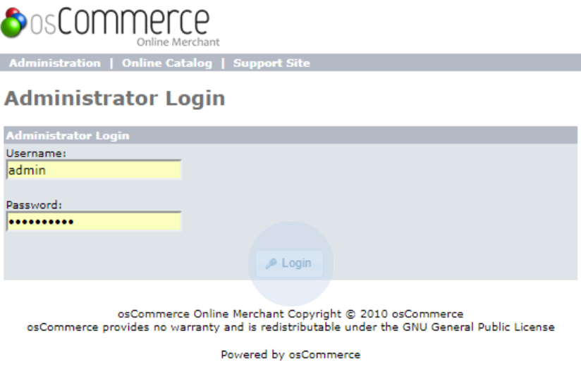

# Requirements

<a href="https://apps.oscommerce.com/Apps&JHMvS&paypay-oscommerce" target="_blank" className="btn-download">Download</a>

- PHP 5.4
- osCommerce 2.3.2
- [SOAP extension](http://php.net/manual/en/book.soap.php)

Once the installation is completed and the shop is configured, go to the administration area
and log in.

