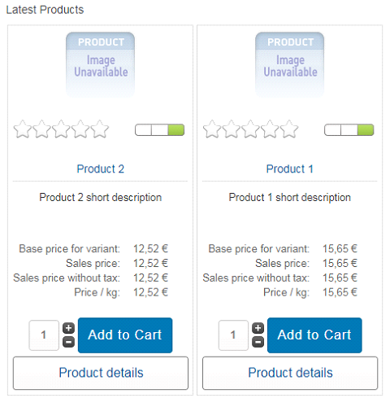
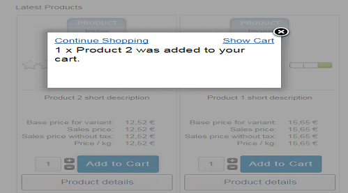
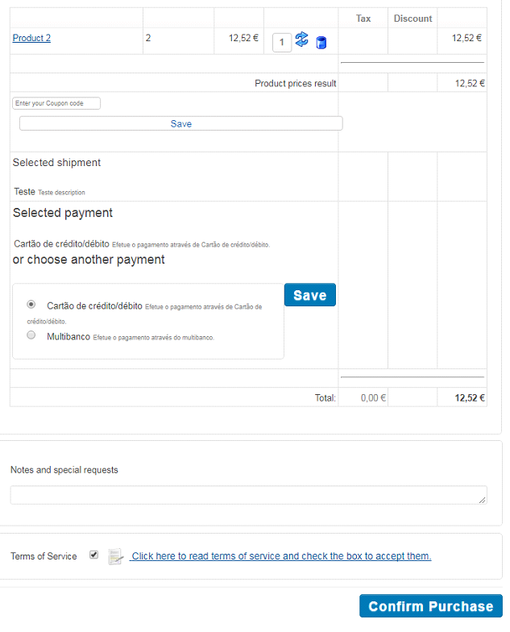
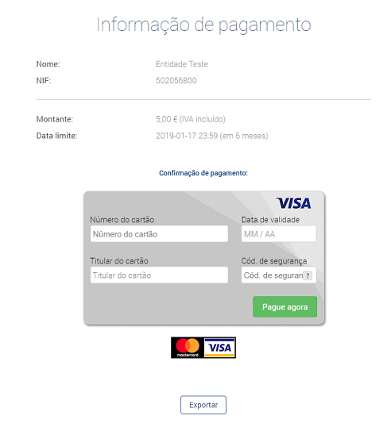
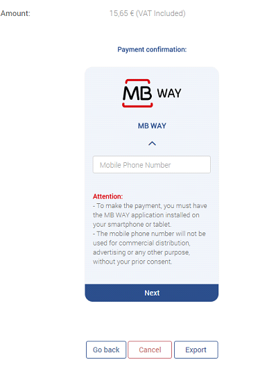
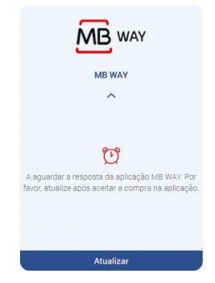
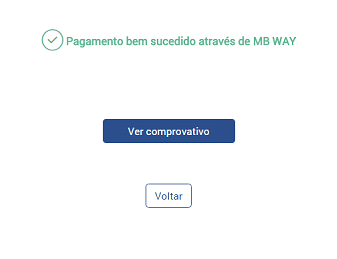
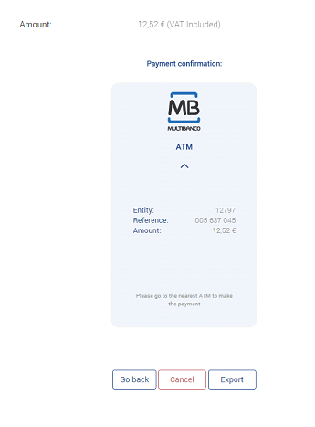

# Payment of the purchase

To purchase a product/service, the customer must log in to the VirtueMart shop and add items to their cart.

After adding the products to the basket, the following message will be displayed.

You must select your preferred payment method (ATM -Multibanco-, Credit/Debit Card or MB WAY), accept the conditions in ‘Terms of service’, and confirm the purchase in ‘Confirm Purchase’.

After confirming the purchase, the customer will be redirected to the PayPay payment area.
If the chosen payment method is ‘Credit/Debit Card’, the payment can be made directly at PayPay.

:::info

Your shop will be responsible for sending the payment details to your customers
by email.

:::

When paying using the ‘MB WAY’ option, you will be redirected to the PayPay payment area.
Enter the mobile phone number associated with your MB WAY account.

After these steps, a payment alert will be sent to the associated number. In the application,
authorise the payment and enter the MB WAY PIN. Once the payment has been made, click
on the ‘Update’ option.

If the payment is successful, you will see the message shown below. By clicking on ‘Back’, you will be redirected to your VirtueMart shop. To obtain the proof of payment, click on the available option.

When the ‘Multibanco’ (ATM), option is selected, the payment reference is generated with
the exact amount of the order. In this area you can only check the summary of your purchase.

