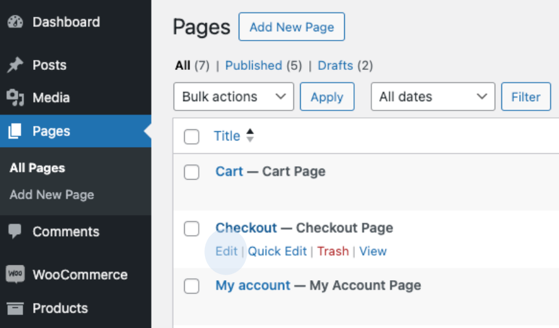
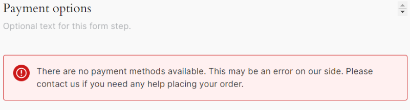
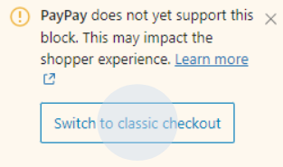
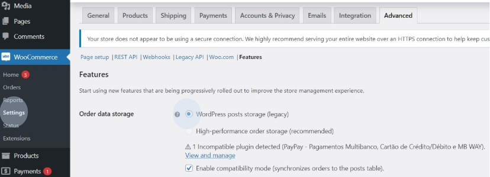

# Problems identified

[Block-based layout on the WooCommerce checkout page](#block-based-layout-on-the-WooCommerce-checkout-page)

[High performance order storage](#high-performance-order-storage)

## Block-based layout on the WooCommerce checkout page

The PayPay WooCommerce plugin does not support the block payment layout. If you are using this type of layout, the payment methods will not be displayed on the checkout page. You will need to change the checkout section to use the classic checkout mode. To do this, follow these steps:

1. On the WordPress administration page, find the checkout page and click on ‘Edit’.

2. After editing the page, select the block associated with the payment methods.

3. If the checkout page is using the block checkout layout, a warning will appear in the right-hand pane of the edit page. Click ‘Update’ to save the changes. The payment methods should now appear when checking out.

## High performance order storage

The PayPay WooCommerce plugin does not support high performance order storage. If you use this type of storage, you will need to switch to ‘WordPress posts storage (legacy)’ and save the changes.

