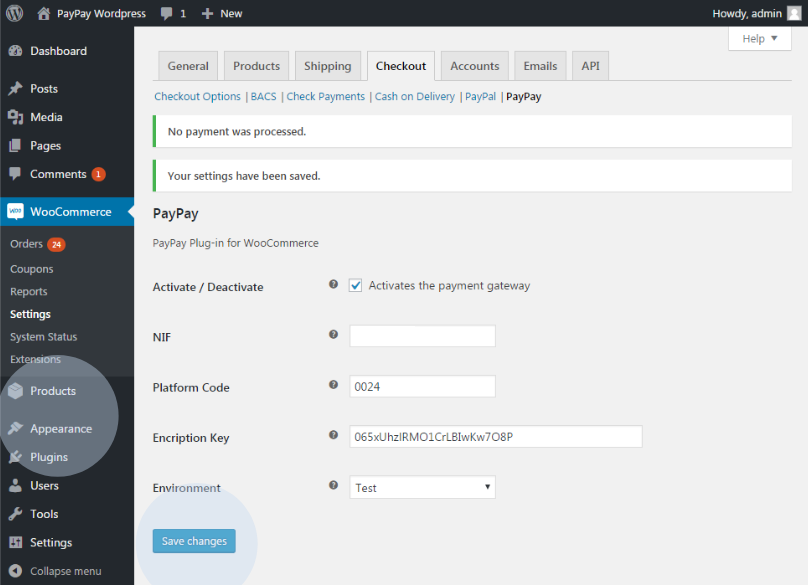

# Manual update of payments

All payments are automatically processed. However, if there is a situation where the payment has been made and the status of the purchase has not been updated, the administrator can manually update the status of the purchase. To do this, you must access the administration area of the WooCommerce shop, go to ‘Plugins’ and select the ‘Save Changes’ option in the plugin configuration area.

:::info

The status of orders changes automatically after payment has been made.

:::
