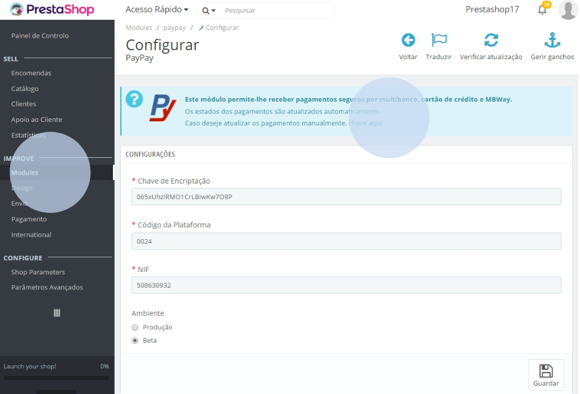
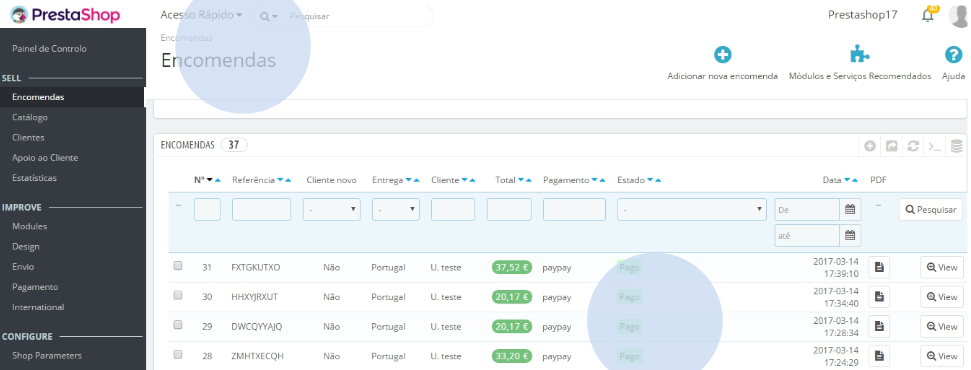

Todos los pagos se procesan automáticamente. Sin embargo, si se ha realizado un pago y no se ha actualizado el estado de la compra, el administrador podrá hacerlo manualmente. Para ello, acceda al área de administración de PrestaShop, vaya a ‘Módulos’ > ‘Módulos y Servicios’, y haga clic en la opción ‘Si desea actualizar los pagos manualmente, haga clic aquí’.

Tras el paso anterior, será redirigido al área de pedidos del administrador y el estado del pago se actualizará automáticamente.

