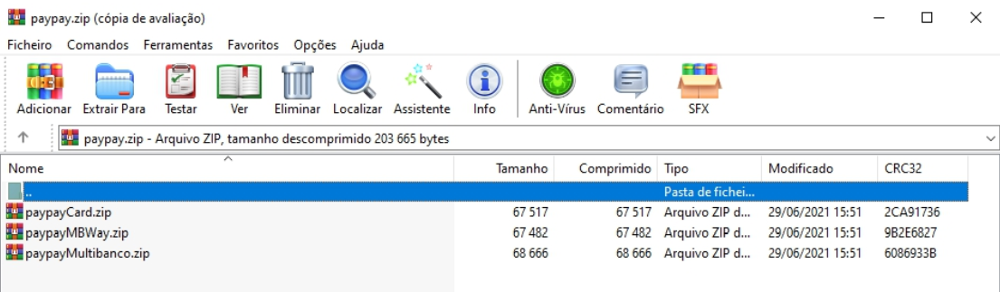
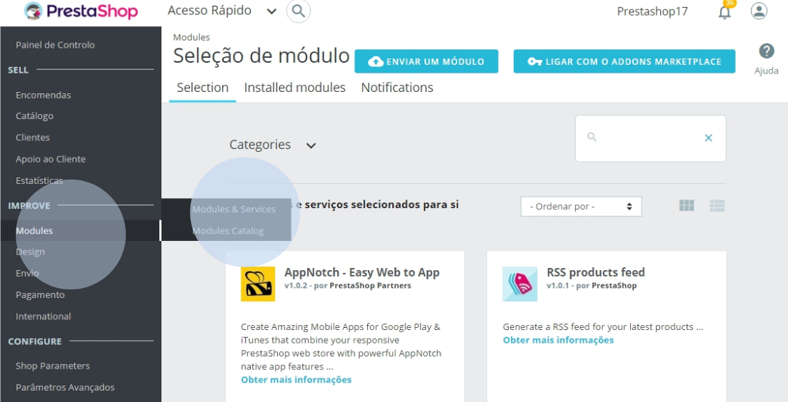
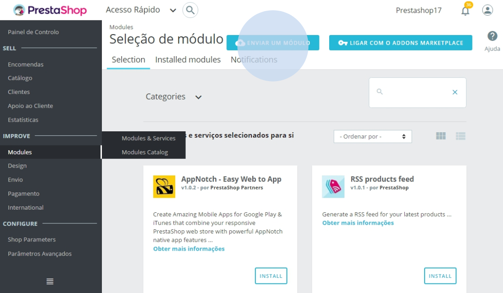
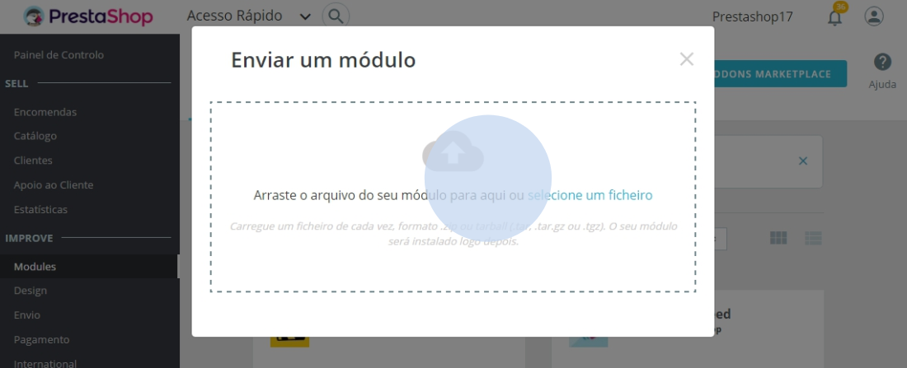
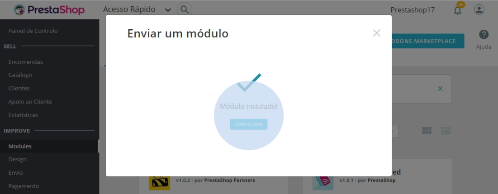
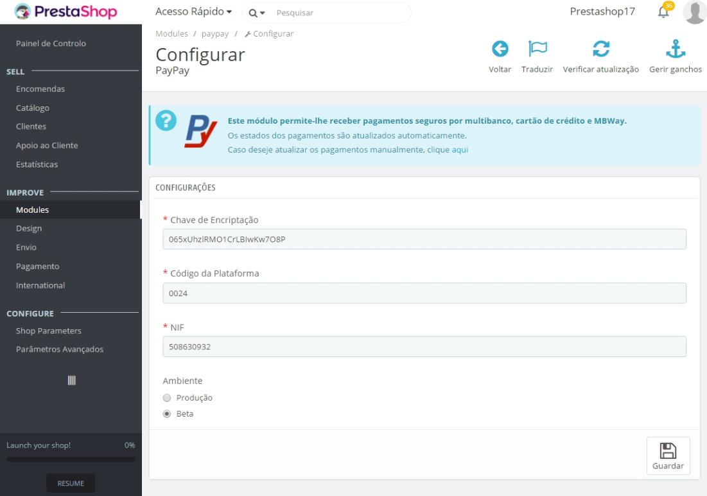

Una vez descargada la carpeta comprimida, extraiga los ficheros zip. A continuación, siga
los pasos que se indican a continuación para cada módulo que desee instalar.

En el entorno de administración/backoffice de su tienda de comercio electrónico, vaya
a la pestaña ‘Módulos’> ‘Módulos y Servicios’.

Haga clic en ‘Enviar un módulo’.

Aparecerá la siguiente área donde podrá arrastrar o seleccionar el módulo que desea importar. El módulo debe estar en formato ZIP o tarball y solamente deberá cargar uno cada vez.

Tras el paso anterior, el módulo quedará automáticamente instalado en su tienda. Haga clic en ‘Configurar’ para iniciar la configuración.

En el formulario deberá introducir los datos de acceso al webservice de PayPay. Para obtener estos datos, vaya a PayPay en Configurar > Integraciones > Plataformas de integración > Añadir (Extensión PrestaShop), y al final, seleccione la opción ‘Guardar’.

:::info

Su tienda ya puede generar y proporcionar datos de pago a sus clientes en tiempo real, según el método de pago seleccionado (cajero automático - Multibanco-, Tarjeta de Crédito/Débito y MB WAY). 
Si tiene alguna pregunta, no dude en ponerse en contacto con nosotros. Estaremos encantados de ayudarle en la configuración.

:::
