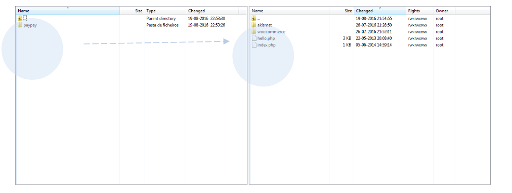
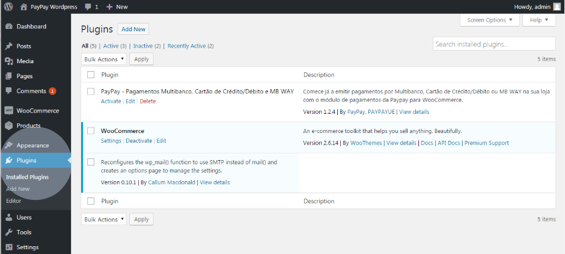
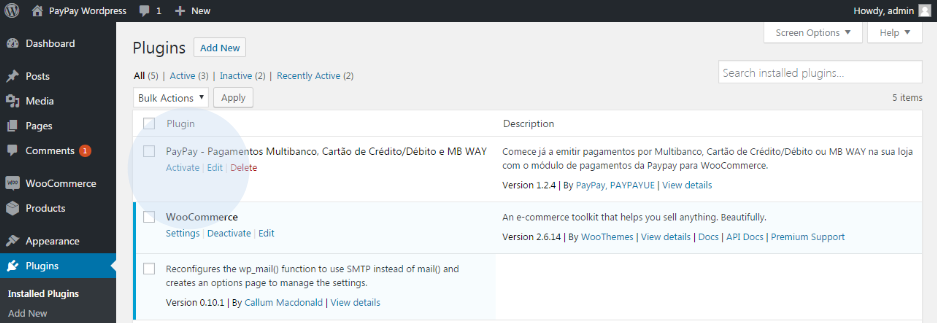
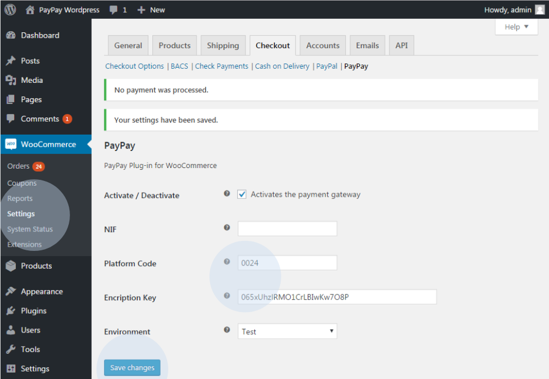
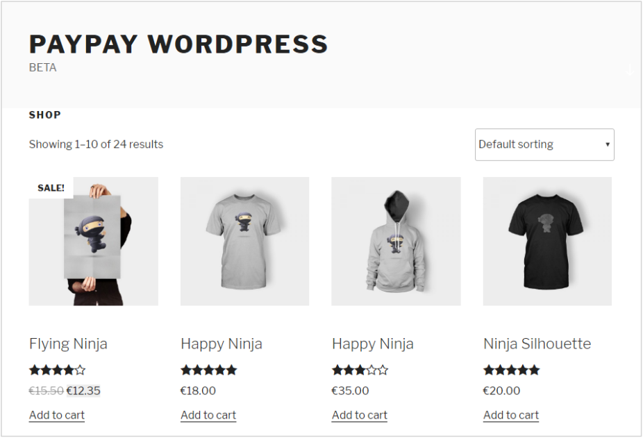

Copie los ficheros proporcionados por PayPay en la carpeta de plugins de WordPress.

:::info

En caso de que haya otros módulos de pago instalados, deberá asegurarse de que no haya ningún fichero que se superponga al existente.

:::

En el entorno de administración/backoffice de su tienda de comercio electrónico, vaya
al menú ‘Plugins’ y seleccione la opción ‘Plugins Instalados’.

En esta área podrá ver el módulo de pago PayPay (Cajero Automático -Multibanco-,
Tarjeta de Crédito/Débito y MB WAY). Activar el plugin de PayPay.

Haga clic en la opción ‘Ajustes’ y rellene los campos con los datos de PayPay, que puede obtener en ‘Configurar’ > ‘Integraciones’ > ‘Plataformas de Integración’ > ‘Añadir’ (Extensión WooCommerce), y al final, seleccione la opción ‘Guardar’.

Puede utilizar el entorno de prueba para probar la integración antes de iniciarla en el
entorno de producción. Para ello, utilice los siguientes datos de acceso:

<table>
    <tr>
        <td>NIF</td>
        <td></td>
    </tr>
    <tr>
        <td>Código de Plataforma:</td>
        <td>0009</td>
    </tr>
    <tr>
        <td>Chave de encriptação:</td>
        <td>4F16A63E4ABA1</td>
    </tr>
</table>

Vaya a https://paypay.acin.pt/paypaybeta/ y consulte el estado de los pagos:

<table>
    <tr>
        <td>Utilizador:</td>
        <td>woocommerce@paypaybeta.pt</td>
    </tr>
    <tr>
        <td>Password:</td>
        <td>DPdZesMkpx</td>
    </tr>
</table>

Tras la configuración, podrá comprobar si tiene algún pago pendiente

La siguiente imagen muestra la página de inicio de su tienda WooCommerce. Si no tiene ningún artículo disponible, tendrá que crearlo en su área de administración.

:::info

Ahora su tienda puede generar y proporcionar datos de pago a sus clientes en tiempo real, según el método de pago elegido (Cajero Automático -Multibanco-, Tarjeta de Crédito/Débito y MB WAY). 
Si tiene alguna pregunta, no dude en ponerse en contacto con nosotros. Estamos disponibles para ayudarle con la configuración.

:::
