Para comprar un producto/servicio, el cliente debe iniciar sesión en la tienda WooCommerce.

Añadir artículos a la cesta.

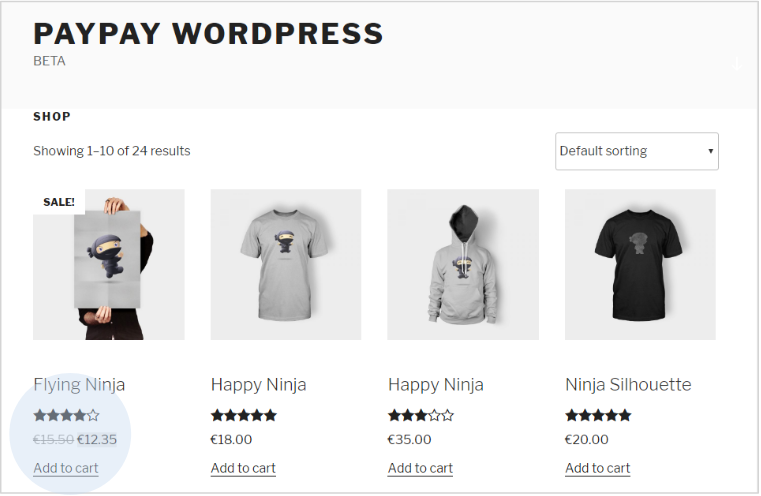

Para confirmar su compra, haga clic en ‘Checkout’.

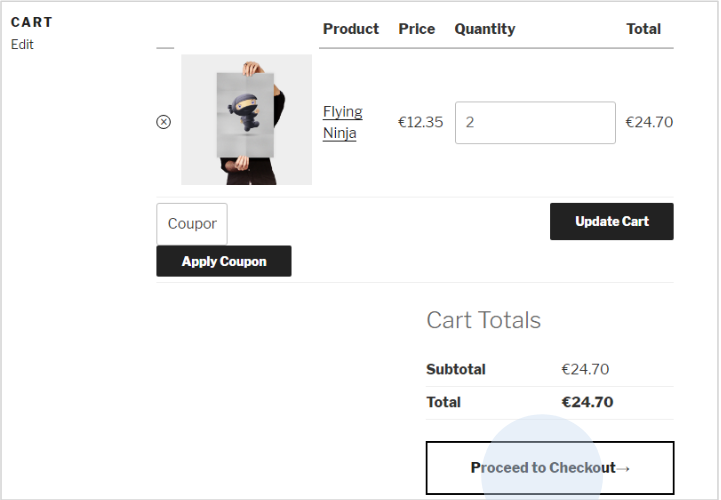

Una vez rellenados los datos de entrega, debe seleccionar el tipo de pago (Cajero Automático -Multibanco-, Tarjeta de Crédito/Débito o MB WAY).

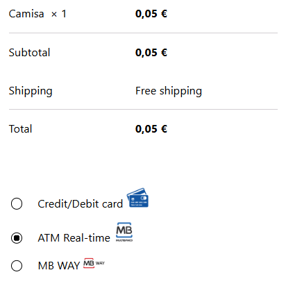

:::info

La configuración de los métodos de pago debe definirse en el área de clientes de PayPay. También puede definir los importes mínimos y máximos para los diferentes métodos de pago y así obtener un mayor control sobre los límites.

:::

Al seleccionar la opción ‘Multibanco’ (cajero automático), se generará una referencia de pago por el importe exacto del pedido. En esta área podrá ver un resumen de su compra.

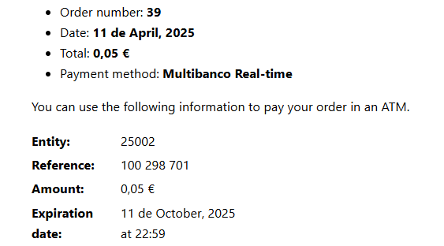

Accediendo al historial de pedidos, podrá ver los detalles del pedido que acaba de realizar

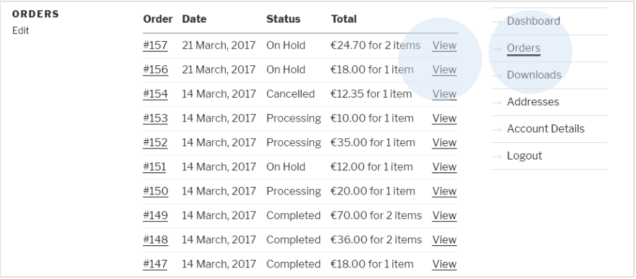

En los detalles del último pedido que ha realizado, verá la referencia de pago generada por Paypay.

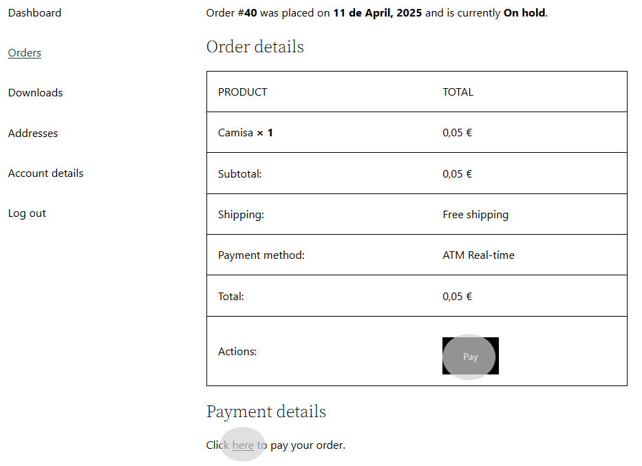

Una vez pagado el pedido, aparecerá el mensaje de éxito y se actualizará el estado del pedido.

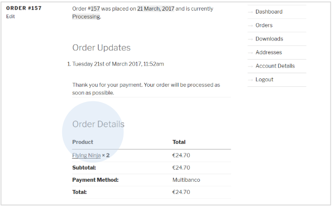

En caso de que el cliente haya seleccionado la opción de pago ‘Tarjeta de Crédito/Débito’, será redirigido al área de pago de PayPay. Deberá introducir los datos de su tarjeta de crédito y validar.

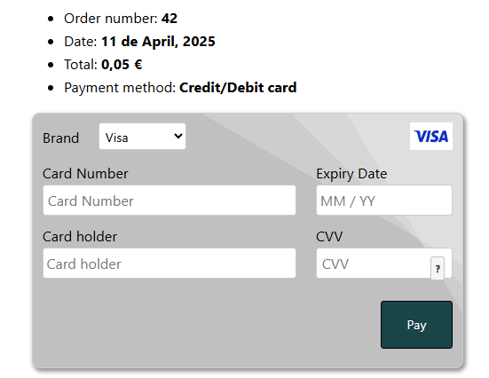

Accediendo a la tienda WooCommerce, podrá confirmar que el estado de su pedido ha sido debidamente actualizado.

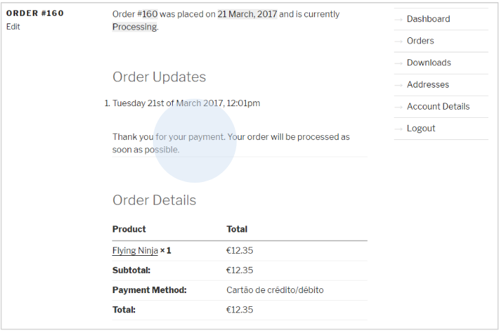

:::info

Su tienda enviará los datos de pago a los clientes por correo electrónico.

:::

Si realiza el pago mediante la opción ‘MB WAY’, será redirigido a al área de pago de PayPay.

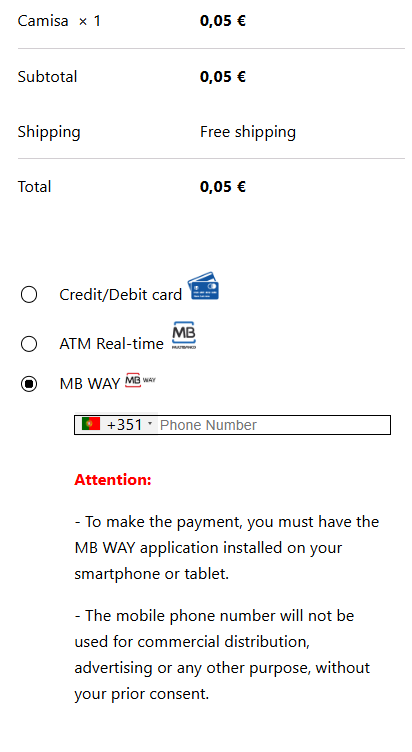

Introduzca el número de teléfono móvil asociado a la cuenta MB WAY.

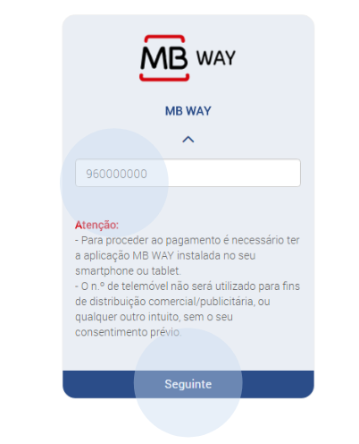

Tras estos pasos, se enviará una alerta de pago al número asociado. En la aplicación, autorice el pago e introduzca el PIN de MB WAY. Una vez realizado el pago, haga clic en la opción ‘Actualizar’.

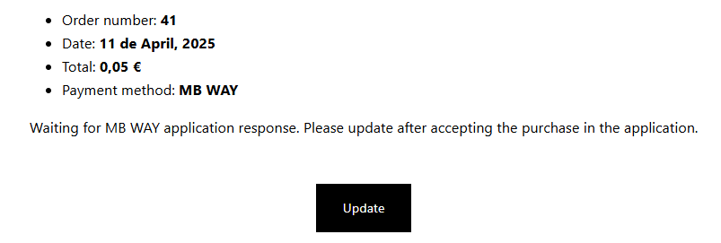

Si el pago se ha realizado correctamente, se le mostrará el mensaje indicado más abajo. Al hacer clic en ‘Atrás’ será redirigido a su tienda WooCommerce. Para obtener el comprobante de pago, haga clic en la opción correspondiente.

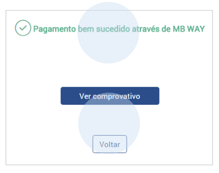
