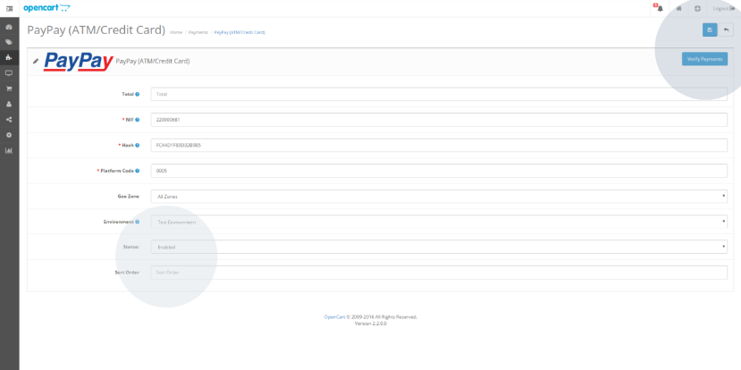

# Actualizar los pagos manualmente

Todos los pagos se procesan automáticamente. Sin embargo, si se ha realizado un pago y no se ha actualizado el estado de la compra en la tienda OpenCart, el administrador de la tienda podrá utilizar el botón ‘Verify Payments’ para actualizar manualmente todos los pagos pendientes, disponible en la pestaña del módulo de pagos ‘Payments’ del ‘Dashboard’.  Cambie también el ‘Status’ del pago.

