## Realizar el pago de la compra

Cuando el cliente desea proceder a la compra de un producto/servicio, deberá iniciar sesión en la tienda Zen Cart.

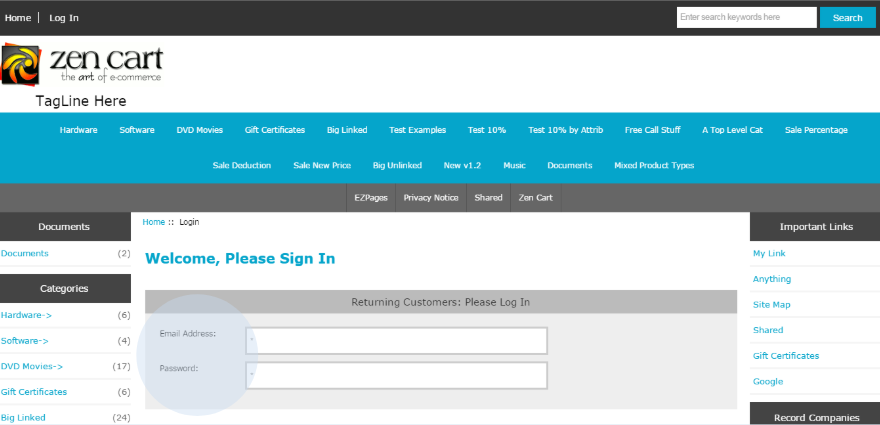

Añadir artículos a la cesta.

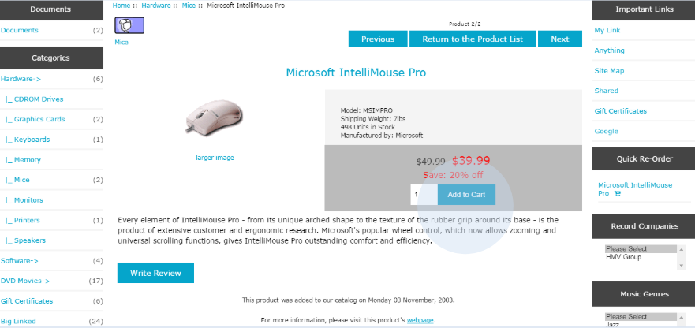

Para confirmar la compra, haga clic en ‘Checkout’.

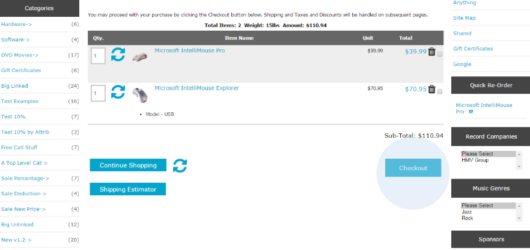

Introduzca los datos de entrega.

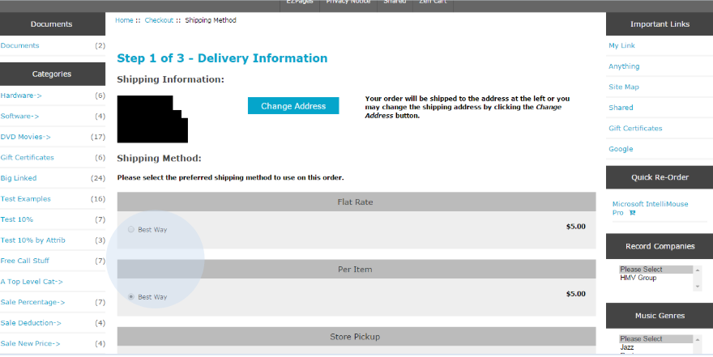

Seleccione el método de pago de PayPay: ‘Tarjeta de Crédito/Débito’ o Cajero automático (‘Multibanco’).

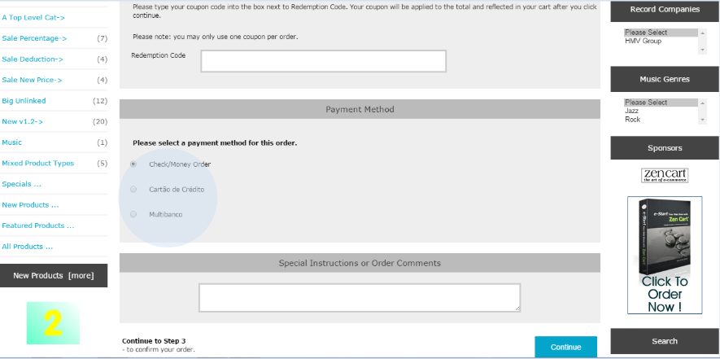

Al seleccionar la opción de cajero automático (‘Multibanco’), aparecerá el resumen de la compra. Para confirmar el pedido, haga clic en ‘Confirm Order’.

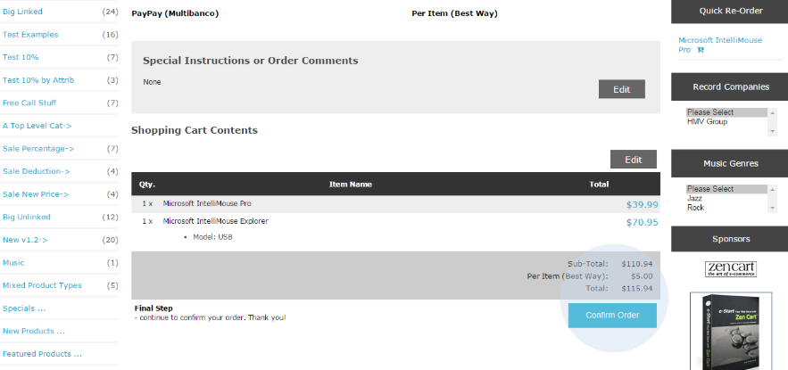

Tras este paso, se generará la referencia de pago.

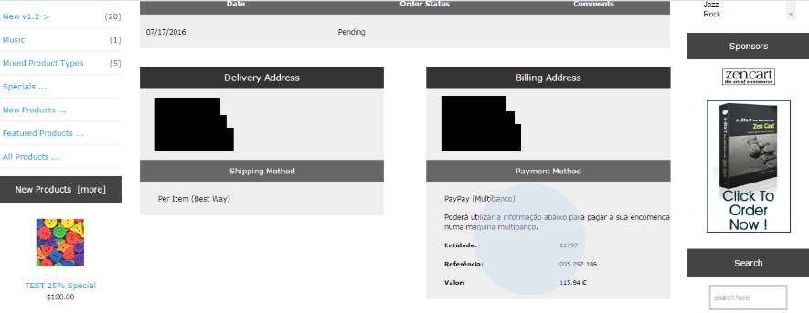

Una vez que el pedido haya sido pagado, aparecerá el mensaje de éxito y se actualizará el estado del pedido.

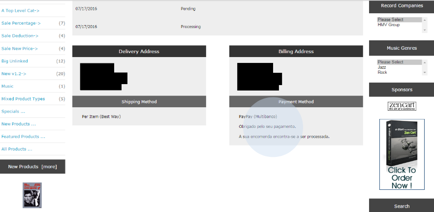

Si el cliente ha seleccionado la opción de pago ‘Tarjeta de Crédito/Débito’, deberá hacer clic en el enlace y será redirigido automáticamente al área de pago de PayPay.

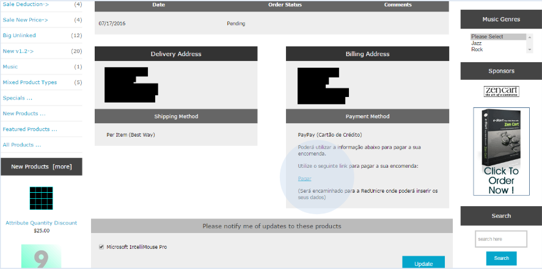

Introduzca los datos de su Tarjeta de Crédito y realice el pago.

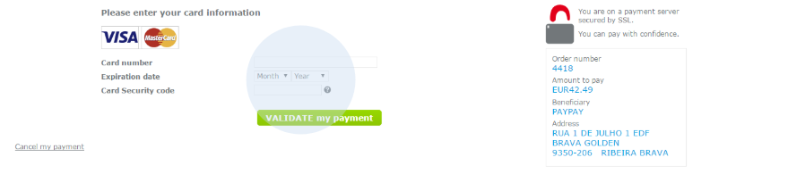

Y si son correctas tu compra queda validada.

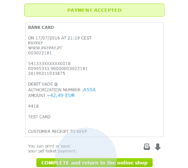

Al acceder a la tienda Zen Cart podrá confirmar que el estado de su pedido ha cambiado.

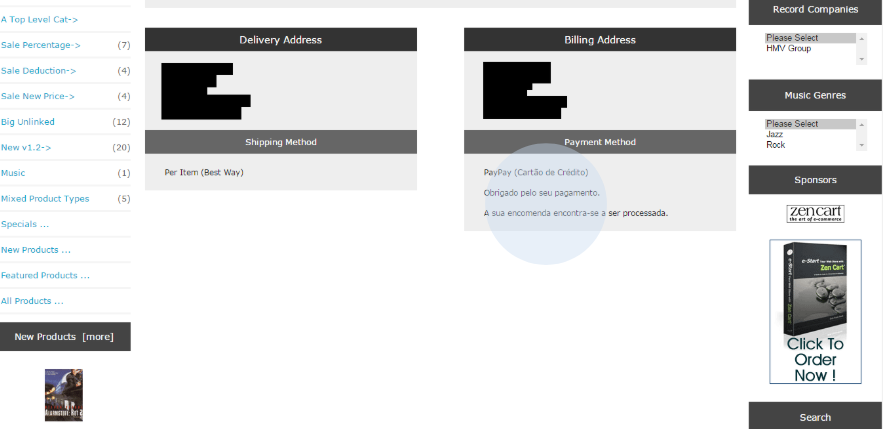
