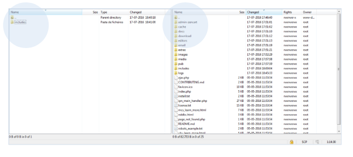
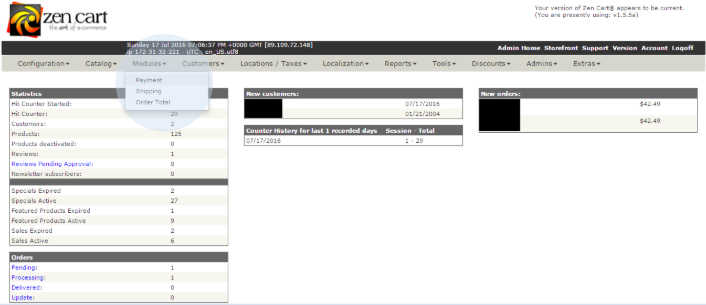
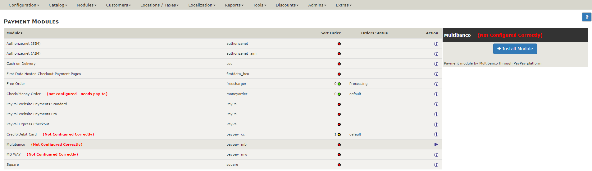
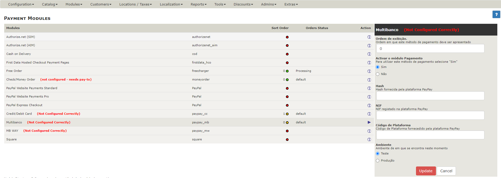
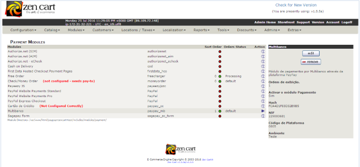

# Pasos de Configuración

Copie los ficheros proporcionados por PayPay en su carpeta de instalación de Zen Cart.

:::info

Si tiene instalados otros módulos de pago, debe asegurarse de que no haya ningún fichero superpuesto al ya existente.

:::

En el entorno de administración/backoffice de su tienda de comercio electrónico, vaya al menú ‘Modules’.

En esta área podrá ver los dos módulos de pago de la plataforma PayPay: Cajero Automático (Multibanco) y Tarjeta de Crédito/Débito.

Instale los módulos deseados. Si elige instalar un módulo, únicamente el módulo que haya instalado estará disponible para sus clientes. Rellene los campos con los datos facilitados por su gestor de cuenta PayPay y, al final, seleccione la opción ‘update’.

:::info

Puede utilizar el entorno de prueba para realizar pruebas de integración antes de comenzar en el entorno de producción.

:::

Después de este paso podrá ver los tipos de pago definidos.

:::info

Ahora su tienda puede generar y proporcionar datos de pago a sus clientes en tiempo real, según el método de pago seleccionado (cajero automático - Multibanco- o Tarjeta de Crédito/Débito). 
Si tiene alguna pregunta, no dude en ponerse en contacto con nosotros. Estamos a su disposición para ayudarle con la configuración.

:::
